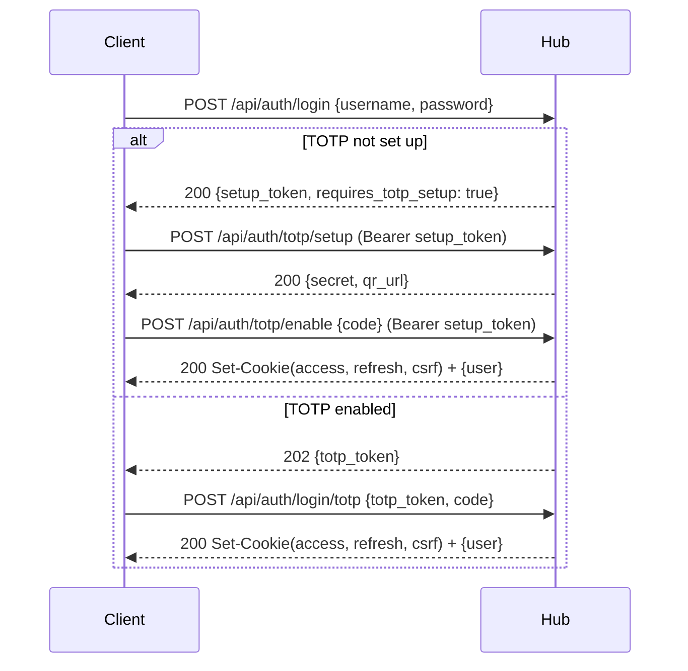

# Veyport Hub API Reference

> **TL;DR**
> - **What:** 50+ REST API endpoints covering auth, user management, server operations, terminal sessions, audit logs, notifications, LDAP config, SMTP config, hub settings, and agent/CLI installation
> - **Who:** Frontend developers, integration builders, and anyone automating Veyport
> - **Why:** Complete reference for every HTTP endpoint with request/response schemas
> - **Where:** All endpoints served by the Hub on the HTTP port (default :8081)
> - **When:** After authentication - most endpoints require a valid JWT access token or CLI-created API token
> - **How:** JSON request/response bodies; secure cookie auth for browsers with Bearer fallback for scripts/API tokens; SSE for streaming

---

## Table of Contents

1. [Overview](#overview)
2. [Authentication Flow](#authentication-flow)
3. [Error Format](#error-format)
4. [Auth Endpoints](#auth-endpoints)
5. [User Management Endpoints](#user-management-endpoints)
6. [Audit Log Endpoints](#audit-log-endpoints)
7. [Server Endpoints](#server-endpoints)
8. [Path Permission Endpoints](#path-permission-endpoints)
9. [Agent Operation Endpoints](#agent-operation-endpoints)
10. [Installation Endpoints](#installation-endpoints)
11. [Server Removal Endpoints](#server-removal-endpoints)
12. [Hub Settings Endpoints](#hub-settings-endpoints)
13. [LDAP Directory Endpoints](#ldap-directory-endpoints)
14. [SMTP and Notification Endpoints](#smtp-and-notification-endpoints)
15. [Re-Enrollment Endpoints](#re-enrollment-endpoints)
16. [Terminal Endpoints](#terminal-endpoints)
17. [SSH Gateway Endpoints](#ssh-gateway-endpoints)
18. [Session Endpoints](#session-endpoints)

---

## Overview

| Property | Value |
|---|---|
| Base URL | `http://<hub-host>:8081` (dev) or `https://<hub-domain>` (prod) |
| Content Type | `application/json` (request and response) |
| Browser Auth | `veyport_access` and `veyport_refresh` secure cookies, plus `veyport_csrf` for mutating requests |
| API Client Auth | `Authorization: Bearer <JWT access token or CLI-created API token>` |
| Pagination | `?limit=N&offset=N` (default limit varies, max 100) |
| CORS | Enabled in dev mode for `http://localhost:5173` |
| Caching | `Cache-Control: no-store` on all API responses |

All request and response bodies are JSON unless otherwise noted (file uploads use `multipart/form-data`, SSE streams use `text/event-stream`, binary downloads use `application/octet-stream`).

For browser sessions, successful login and refresh flows set auth cookies and may omit token strings from the JSON response body. The cURL examples below use Bearer headers because they are intended for scripts and API clients.

---

## Authentication Flow

Veyport uses four JWT token types. In browser-driven flows, the resulting access and refresh tokens are set as secure cookies.

| Token Type | Purpose | Lifetime |
|---|---|---|
| **Setup** | Issued after first login when TOTP is not yet configured. Authorizes `/api/auth/totp/setup` and `/api/auth/totp/enable`. | Short-lived |
| **TOTP** | Issued after password verification when TOTP is enabled. Authorizes `/api/auth/login/totp`. | Short-lived |
| **Access** | General-purpose API token. Required by most endpoints. | Short-lived |
| **Refresh** | Long-lived token used to obtain a new access/refresh pair via `/api/auth/refresh`. | Long-lived |

For non-browser automation, Veyport also supports opaque API tokens created with the Hub CLI. These are not JWTs, are stored as SHA-256 hashes at rest, and are recommended over automating a human password + TOTP secret.

### Machine Authentication

Create a dedicated low-privilege user for automation, then mint an API token on the Hub host:

```bash
# Docker deployment
docker exec veyport /app/veyport admin create-api-token \
  --username scanner \
  --name nightly-scan \
  --expires-in 720h \
  --db /data/veyport.db

# Bare-metal deployment
./bin/veyport admin create-api-token \
  --username scanner \
  --name nightly-scan \
  --expires-in 720h \
  --db /var/lib/veyport/veyport.db
```

Use the returned token with the standard Bearer header:

```bash
curl -H "Authorization: Bearer adt_..." https://hub.example.com/api/auth/me
```

API tokens can call normal access-token-protected API endpoints, but they are intentionally rejected on interactive account-management endpoints such as password changes, avatar updates, and TOTP disable.

### Typical Login Flow



---

## Error Format

All errors return a JSON object with a single `error` key:

```json
{
  "error": "human-readable error message"
}
```

The HTTP status code indicates the error category:

| Status | Meaning |
|---|---|
| 400 | Bad Request - invalid input, missing required fields |
| 401 | Unauthorized - invalid credentials or expired token |
| 403 | Forbidden - insufficient permissions |
| 404 | Not Found - resource does not exist |
| 409 | Conflict - resource already exists (e.g., duplicate user) |
| 413 | Request Entity Too Large - file exceeds size limit |
| 429 | Too Many Requests - rate limit exceeded |
| 500 | Internal Server Error |
| 502 | Bad Gateway - agent communication failure |
| 504 | Gateway Timeout - agent did not respond in time |

Source: `hub/internal/server/respond.go` -- `respondError(w, status, message)` produces `{"error": message}`.

---

## Auth Endpoints

### 1. GET /api/auth/status

Check whether the Hub has been initialized (at least one user exists).

| Property | Value |
|---|---|
| Auth | None |
| Rate Limited | No |

**Response (200) - unauthenticated:**

```json
{
  "initialized": true
}
```

**Response (200) - authenticated (with valid access token):**

```json
{
  "initialized": true,
  "version": "vX.Y.Z"
}
```

> **Note:** The `version` field is only included when the request carries a valid access token. Unauthenticated requests receive only the `initialized` field.

**cURL:**

```bash
curl https://hub.example.com/api/auth/status
```

---

### 2. POST /api/auth/register

Register the first admin user. Only works when no users exist (`initialized: false`).

| Property | Value |
|---|---|
| Auth | None |
| Rate Limited | Yes (10 requests / 60s) |

**Request Body:**

```json
{
  "username": "admin",
  "email": "admin@example.com",
  "password": "S3cur3P@ssw0rd!"
}
```

**Validation rules:**
- Username: 3-32 characters, alphanumeric and underscores only
- Password: must satisfy `auth.ValidatePasswordPolicy` (minimum length, complexity)

**Response (200):**

```json
{
  "setup_token": "eyJhbGci...",
  "user": {
    "id": "uuid",
    "username": "admin",
    "email": "admin@example.com",
    "role": "admin",
    "totp_enabled": false,
    "avatar": null,
    "created_at": "2025-01-01T00:00:00Z",
    "updated_at": "2025-01-01T00:00:00Z"
  }
}
```

**Error Cases:**
- `403` - Registration disabled (users already exist)
- `400` - Invalid username or password policy violation
- `409` - User already exists

**cURL:**

```bash
curl - X POST https://hub.example.com/api/auth/register \
  - H 'Content-Type: application/json' \
  - d '{"username":"admin","email":"admin@example.com","password":"S3cur3P@ssw0rd!"}'
```

---

### 3. POST /api/auth/login

Authenticate with username and password.

| Property | Value |
|---|---|
| Auth | None |
| Rate Limited | Yes (10 requests / 60s) |

**Request Body:**

```json
{
  "username": "admin",
  "password": "S3cur3P@ssw0rd!"
}
```

**Response when TOTP is not set up (200):**

```json
{
  "setup_token": "eyJhbGci...",
  "requires_totp_setup": true
}
```

**Response when TOTP is enabled (202):**

```json
{
  "totp_token": "eyJhbGci..."
}
```

**Error Cases:**
- `401` - Invalid credentials
- `403` - Account disabled or dormant: `{"error":"account disabled — contact an administrator"}` / `{"error":"account dormant — contact an administrator"}`. Returned before the password is checked or any LDAP bind is attempted; see [Account State Enforcement](#account-state-enforcement).
- `423` - Account temporarily locked: `{"error":"account temporarily locked — try again later"}`. Returned before the password is checked or any LDAP bind is attempted, and does not change the account's failure count.

**cURL:**

```bash
curl - X POST https://hub.example.com/api/auth/login \
  - H 'Content-Type: application/json' \
  - d '{"username":"admin","password":"S3cur3P@ssw0rd!"}'
```

---

### 4. POST /api/auth/login/totp

Complete login by providing a TOTP code (second factor).

| Property | Value |
|---|---|
| Auth | None (TOTP token in body) |
| Rate Limited | Yes (3 requests / 60s) |

**Request Body:**

```json
{
  "totp_token": "eyJhbGci...",
  "code": "123456"
}
```

**Response (200):**

```json
{
  "user": {
    "id": "uuid",
    "username": "admin",
    "email": "admin@example.com",
    "role": "admin",
    "totp_enabled": true,
    "avatar": null,
    "created_at": "2025-01-01T00:00:00Z",
    "updated_at": "2025-01-01T00:00:00Z"
  }
}
```

On success, the Hub also sets `veyport_access`, `veyport_refresh`, and `veyport_csrf` cookies for browser clients.

**Error Cases:**
- `401` - Invalid or expired TOTP token, invalid TOTP code, user not found
- `403` - Account disabled or dormant, same messages as login, returned before the code is validated; see [Account State Enforcement](#account-state-enforcement).
- `423` - Account temporarily locked: `{"error":"account temporarily locked — try again later"}`. Returned before the code is validated. A wrong code counts as a failure exactly like a wrong password; a correct code resets the failure count and clears the lock.

**cURL:**

```bash
curl - X POST https://hub.example.com/api/auth/login/totp \
  - H 'Content-Type: application/json' \
  - d '{"totp_token":"eyJhbGci...","code":"123456"}'
```

---

### 5. POST /api/auth/refresh

Exchange a refresh token for a new access/refresh token pair.

| Property | Value |
|---|---|
| Auth | None. Browser clients usually send the `veyport_refresh` cookie; non-browser clients may send `refresh_token` in the JSON body |
| Rate Limited | Yes (30 requests / 60s) |

**Request Body:**

```json
{
  "refresh_token": "eyJhbGci..."
}
```

**Response (200):**

```json
{}
```

On success, the Hub rotates the refresh token and sets new `veyport_access`, `veyport_refresh`, and `veyport_csrf` cookies.

**Error Cases:**
- `401` - Invalid or expired refresh token
- `401` - Account disabled or dormant, same messages as login; see [Account State Enforcement](#account-state-enforcement)

**cURL:**

```bash
curl - X POST https://hub.example.com/api/auth/refresh \
  - H 'Content-Type: application/json' \
  - d '{"refresh_token":"eyJhbGci..."}'
```

---

### 6. POST /api/auth/totp/setup

Generate a new TOTP secret and QR URL. The secret is stored but not yet enabled.

| Property | Value |
|---|---|
| Auth | Setup token (Bearer) |
| Rate Limited | No |

**Request Body:** None

**Response (200):**

```json
{
  "secret": "JBSWY3DPEHPK3PXP",
  "qr_url": "otpauth://totp/Veyport:admin?secret=JBSWY3DPEHPK3PXP&issuer=Veyport"
}
```

**Error Cases:**
- `401` - Invalid or expired setup token
- `404` - User not found

**cURL:**

```bash
curl - X POST https://hub.example.com/api/auth/totp/setup \
  - H 'Authorization: Bearer <setup_token>'
```

---

### 7. POST /api/auth/totp/enable

Verify and enable TOTP by providing a valid code. For users created with a temporary password, this is also where the permanent password is set.

| Property | Value |
|---|---|
| Auth | Setup token (Bearer) |
| Rate Limited | No |

**Request Body:**

```json
{
  "code": "123456",
  "new_password": "OptionalUnlessTemporaryPassword"
}
```

**Response (200):**

```json
{
  "user": {
    "id": "uuid",
    "username": "admin",
    "email": "admin@example.com",
    "role": "admin",
    "totp_enabled": true,
    "avatar": null,
    "created_at": "2025-01-01T00:00:00Z",
    "updated_at": "2025-01-01T00:00:00Z"
  }
}
```

On success, the Hub also sets `veyport_access`, `veyport_refresh`, and `veyport_csrf` cookies for browser clients. This also counts as a successful sign-in: the account's failure count resets and `last_login_at` is stamped, same as a normal login.

**Error Cases:**
- `401` - Invalid TOTP code
- `400` - TOTP not set up (call `/api/auth/totp/setup` first)

**cURL:**

```bash
curl - X POST https://hub.example.com/api/auth/totp/enable \
  - H 'Authorization: Bearer <setup_token>' \
  - H 'Content-Type: application/json' \
  - d '{"code":"123456"}'
```

---

### 8. GET /api/auth/me

Get the current authenticated user's profile.

| Property | Value |
|---|---|
| Auth | Access token (Bearer) |
| Rate Limited | No |

**Response (200):**

```json
{
  "id": "uuid",
  "username": "admin",
  "email": "admin@example.com",
  "role": "admin",
  "totp_enabled": true,
  "avatar": "data:image/png;base64,...",
  "created_at": "2025-01-01T00:00:00Z",
  "updated_at": "2025-01-01T00:00:00Z",
  "failed_login_count": 0,
  "last_login_at": "2026-09-04T22:10:33Z",
  "status": "active",
  "dormancy_exempt": false,
  "last_activity_at": "2026-09-04T22:10:33Z"
}
```

Same fields (and same meaning) as `GET /api/users` above: `failed_login_count`,
`last_failed_login_at`, `last_login_at`, `locked_until`, `status`, `disabled_at`, `disabled_by`,
`reactivated_at`, `dormancy_exempt`, `last_activity_at` — always about the caller's own account.

**Error Cases:**
- `404` - User not found
- `401` - Account disabled or dormant; see [Account State Enforcement](#account-state-enforcement)

**cURL:**

```bash
curl https://hub.example.com/api/auth/me \
  - H 'Authorization: Bearer <access_token>'
```

---

### 9. PUT /api/auth/password

Change the authenticated user's password.

| Property | Value |
|---|---|
| Auth | Access token (Bearer) |
| Rate Limited | No |

**Request Body:**

```json
{
  "current_password": "OldP@ssw0rd!",
  "new_password": "N3wP@ssw0rd!"
}
```

**Response (200):**

```json
{
  "status": "password updated"
}
```

> **Note:** A successful password change invalidates all of the user's existing sessions (access and refresh tokens) except the one used to make the request. Other devices will need to log in again.

**Error Cases:**
- `401` - Invalid current password
- `400` - New password does not meet policy requirements
- `404` - User not found

**cURL:**

```bash
curl - X PUT https://hub.example.com/api/auth/password \
  - H 'Authorization: Bearer <access_token>' \
  - H 'Content-Type: application/json' \
  - d '{"current_password":"OldP@ssw0rd!","new_password":"N3wP@ssw0rd!"}'
```

---

### 10. PUT /api/auth/avatar

Update the authenticated user's avatar image.

| Property | Value |
|---|---|
| Auth | Access token (Bearer) |
| Rate Limited | No |

**Request Body:**

```json
{
  "avatar": "data:image/png;base64,iVBOR..."
}
```

Send an empty string to remove the avatar.

**Limits:** Maximum ~500KB base64-encoded data URL (700,000 characters).

**Response (200):**

```json
{
  "status": "avatar updated"
}
```

**Error Cases:**
- `400` - Avatar image too large (max 500KB)

**cURL:**

```bash
curl - X PUT https://hub.example.com/api/auth/avatar \
  - H 'Authorization: Bearer <access_token>' \
  - H 'Content-Type: application/json' \
  - d '{"avatar":"data:image/png;base64,iVBOR..."}'
```

---

### 11. POST /api/auth/totp/disable

Admin-only: disable TOTP for another user. Requires the admin's own TOTP code for verification.

| Property | Value |
|---|---|
| Auth | Access token (Bearer), admin only |
| Rate Limited | No |

**Request Body:**

```json
{
  "user_id": "target-user-uuid",
  "admin_totp_code": "123456"
}
```

**Response (200):**

```json
{
  "status": "totp disabled"
}
```

**Error Cases:**
- `401` - Invalid admin TOTP code
- `404` - Admin user not found
- `403` - Not an admin

**cURL:**

```bash
curl - X POST https://hub.example.com/api/auth/totp/disable \
  - H 'Authorization: Bearer <access_token>' \
  - H 'Content-Type: application/json' \
  - d '{"user_id":"target-user-uuid","admin_totp_code":"123456"}'
```

---

### Account State Enforcement

A disabled or dormant account (see the User Management section below) is refused everywhere it
could otherwise act, with a state-specific message that reveals nothing about credential
correctness: `{"error":"account disabled — contact an administrator"}` or
`{"error":"account dormant — contact an administrator"}`.

| Path | Response |
|---|---|
| `POST /api/auth/login` (local and LDAP) | `403`, before the password is checked or any LDAP bind is attempted; the account's failure count is unchanged; audited `user.login_failed` with detail `account disabled`/`account dormant` |
| `POST /api/auth/login/totp` | `403`, same messages, before the code is validated |
| `POST /api/auth/refresh` | `401`, same messages |
| Any request bearing an access token or an API token | `401`. For a dormant account the body carries the same message. For a disabled account the credentials themselves are already dead — disabling bumps the token generation and revokes every API token — so those requests get the generic `invalid token`. A browser client redirects to `/login` on the next request either way |
| `POST /api/ssh/certificates` | `401`, same messages (the access token is refused before the handler runs, like any other token-bearing request) |
| SSH gateway shell | refused with banner `veyport: <same message>`, audited `ssh.session_refused` |

Precedence at sign-in is disabled > dormant > locked (`423`, see above) > credential check. A
locked account (007) is still refused only at the two sign-in stages above — it is not checked on
refresh, token-bearing requests, or the SSH endpoints.

---

## User Management Endpoints

All user management endpoints require **admin** role.

### 12. GET /api/users

List all users.

| Property | Value |
|---|---|
| Auth | Access token (Bearer), admin only |

**Response (200):**

```json
{
  "users": [
    {
      "id": "uuid",
      "username": "admin",
      "email": "admin@example.com",
      "role": "admin",
      "auth_provider": "local",
      "terminal_access": false,
      "totp_enabled": true,
      "avatar": null,
      "created_at": "2025-01-01T00:00:00Z",
      "updated_at": "2025-01-01T00:00:00Z",
      "failed_login_count": 2,
      "last_failed_login_at": "2026-09-05T10:41:07Z",
      "last_login_at": "2026-09-04T22:10:33Z",
      "locked_until": "2026-09-05T10:56:07Z",
      "status": "dormant",
      "disabled_at": null,
      "disabled_by": null,
      "reactivated_at": "2026-08-01T09:00:00Z",
      "dormancy_exempt": false,
      "last_activity_at": "2026-07-20T17:12:41Z"
    }
  ]
}
```

| Field | Notes |
|---|---|
| `failed_login_count` | Consecutive credential failures since the last success or window reset. Always present. |
| `last_failed_login_at` | RFC 3339 UTC timestamp of the most recent failure. Absent if the account has never failed a login. |
| `last_login_at` | RFC 3339 UTC timestamp of the most recent successful sign-in. Absent if the account has never signed in. |
| `locked_until` | RFC 3339 UTC timestamp of lock expiry. Absent when not locked. May be in the past (a stale lock the next attempt will clear). `9999-12-31T00:00:00Z` means the lock has no automatic expiry. |
| `status` | Derived, computed at read time from the account lifecycle fields and the current policy. One of `active`, `locked`, `disabled`, `dormant`, with precedence `disabled > dormant > locked > active`. Always present. |
| `disabled_at` | RFC 3339 UTC timestamp of the most recent admin disable. Absent when enabled. |
| `disabled_by` | User id of the admin who disabled the account (informational). Absent when enabled. |
| `reactivated_at` | RFC 3339 UTC timestamp of the most recent admin enable or unlock. Absent if never enabled or unlocked by an admin. Feeds the dormancy clock alongside sign-in and API-token activity. |
| `dormancy_exempt` | `true` if the account (an administrator account) is marked "never dormant." Always present; meaningful only on admin accounts. |
| `last_activity_at` | RFC 3339 UTC timestamp of the most recent interactive sign-in or API-token use (see the "Dormant accounts" note in [[Settings]]). Absent if the account has never been used. |

The same fields appear on `GET /api/auth/me` and in the `user` object returned by login -- a
non-admin only ever sees their own values there.

**cURL:**

```bash
curl https://hub.example.com/api/users \
  - H 'Authorization: Bearer <access_token>'
```

---

### 13. POST /api/users

Create a new user. A temporary password is auto-generated.

| Property | Value |
|---|---|
| Auth | Access token (Bearer), admin only |

**Request Body:**

```json
{
  "username": "newuser",
  "email": "newuser@example.com",
  "role": "viewer"
}
```

**Validation:**
- `role` must be `"admin"`, `"auditor"`, or `"viewer"`
- Username: 3-32 characters, alphanumeric and underscores only

**Response (201):**

```json
{
  "user": {
    "id": "uuid",
    "username": "newuser",
    "email": "newuser@example.com",
    "role": "viewer",
    "auth_provider": "local",
    "terminal_access": false,
    "totp_enabled": false,
    "avatar": null,
    "created_at": "2025-01-01T00:00:00Z",
    "updated_at": "2025-01-01T00:00:00Z"
  },
  "temporary_password": "auto-generated-password"
}
```

**Error Cases:**
- `400` - Invalid username or role
- `409` - User already exists

**cURL:**

```bash
curl - X POST https://hub.example.com/api/users \
  - H 'Authorization: Bearer <access_token>' \
  - H 'Content-Type: application/json' \
  - d '{"username":"newuser","email":"newuser@example.com","role":"viewer"}'
```

---

### 14. PUT /api/users/{id}/role

Update a user's role.

| Property | Value |
|---|---|
| Auth | Access token (Bearer), admin only |

**Path Parameters:**
- `id` - Target user UUID

**Request Body:**

```json
{
  "role": "auditor"
}
```

**Response (200):**

```json
{
  "user": {
    "id": "uuid",
    "username": "newuser",
    "email": "newuser@example.com",
    "role": "admin",
    "auth_provider": "local",
    "terminal_access": false,
    "totp_enabled": false,
    "avatar": null,
    "created_at": "2025-01-01T00:00:00Z",
    "updated_at": "2025-01-01T00:00:00Z"
  }
}
```

**Error Cases:**
- `400` - Invalid role or attempting to change own role
- `404` - User not found

Changing an exempt administrator to a non-admin role clears `dormancy_exempt` in the same request
and writes audit event `user.dormancy_exempt_cleared` with detail `role changed`.

**cURL:**

```bash
curl - X PUT https://hub.example.com/api/users/USER_UUID/role \
  - H 'Authorization: Bearer <access_token>' \
  - H 'Content-Type: application/json' \
  - d '{"role":"admin"}'
```

---

### PUT /api/users/{id}/status

Disable or enable a user account (feature 008). See [Account State Enforcement](#account-state-enforcement) for where a disabled/dormant account is refused.

| Property | Value |
|---|---|
| Auth | Access token (Bearer), admin only |

**Path Parameters:**
- `id` - Target user UUID

**Request Body:**

```json
{
  "disabled": true
}
```

**Response (200), disabling:**

```json
{
  "user": {
    "id": "uuid",
    "status": "disabled",
    "disabled_at": "2026-09-06T10:00:00Z",
    "disabled_by": "b2c1...",
    "...": "…other user fields"
  }
}
```

**Response (200), enabling** (`{"disabled": false}`): the user object with `status: "active"` (or
`"locked"`/`"dormant"` if still applicable) and `reactivated_at` set to now.

**Error Cases:**
- `400` - `{"error":"cannot disable your own account"}` — target is the caller
- `404` - `{"error":"user not found"}`
- `409` - `{"error":"cannot disable the last enabled administrator"}` — target is the only remaining account with role `admin` and no `disabled_at`

Disabling an already-disabled account (or enabling an already-enabled one) returns 200 with the
unchanged user — idempotent, but still audited.

**Side effects of disabling:** `token_generation` is bumped, so the account's existing web
sessions and refresh tokens are rejected on their next use; **all** of the account's API tokens
are revoked (not merely suspended — new ones must be minted after re-enable); audit
`user.disabled` with detail `{"revoked_api_tokens":N}`. **Side effects of enabling:**
`locked_until` and `failed_login_count` are cleared, `reactivated_at` is set to now (which also
restarts the dormancy clock), audit `user.enabled`.

**cURL:**

```bash
curl - X PUT https://hub.example.com/api/users/USER_UUID/status \
  - H 'Authorization: Bearer <access_token>' \
  - H 'Content-Type: application/json' \
  - d '{"disabled":true}'
```

---

### POST /api/users/{id}/unlock

Clear a locked account's lock and consecutive-failure count (feature 008).

| Property | Value |
|---|---|
| Auth | Access token (Bearer), admin only |

**Path Parameters:**
- `id` - Target user UUID

**Response (200):** the user object, `status` no longer `locked` and `failed_login_count: 0`.
Idempotent on an account that is not currently locked (still 200, still audited).

**Error Cases:**
- `404` - `{"error":"user not found"}`

Audit `user.unlocked` with detail `{"was_locked":true|false}`.

**cURL:**

```bash
curl - X POST https://hub.example.com/api/users/USER_UUID/unlock \
  - H 'Authorization: Bearer <access_token>'
```

---

### PUT /api/users/{id}/dormancy-exemption

Assign or remove the "never dormant" exemption on an administrator account (feature 008).

| Property | Value |
|---|---|
| Auth | Access token (Bearer), admin only |

**Path Parameters:**
- `id` - Target user UUID

**Request Body:**

```json
{
  "exempt": true
}
```

**Response (200):** the user object with the updated `dormancy_exempt` value.

**Error Cases:**
- `400` - `{"error":"dormancy exemption applies to administrator accounts only"}` — target's role is not `admin`
- `404` - `{"error":"user not found"}`

Audit `user.dormancy_exempt_set` when `exempt: true`, `user.dormancy_exempt_cleared` when
`exempt: false`. The exemption is also cleared automatically (same audit action, detail
`role changed`) when an exempt account's role is changed away from admin — see endpoint 14 above.

**cURL:**

```bash
curl - X PUT https://hub.example.com/api/users/USER_UUID/dormancy-exemption \
  - H 'Authorization: Bearer <access_token>' \
  - H 'Content-Type: application/json' \
  - d '{"exempt":true}'
```

---

### 15. DELETE /api/users/{id}

Delete a user.

| Property | Value |
|---|---|
| Auth | Access token (Bearer), admin only |

**Path Parameters:**
- `id` - Target user UUID

**Response (200):**

```json
{
  "status": "user deleted"
}
```

**Error Cases:**
- `400` - Cannot delete your own account
- `404` - User not found

**cURL:**

```bash
curl - X DELETE https://hub.example.com/api/users/USER_UUID \
  - H 'Authorization: Bearer <access_token>'
```

---

## Audit Log Endpoints

Audit viewing and workflow endpoints are available to **admins and auditors**. Admins can additionally update audit settings and run retention. The current audit API surface includes:

- `GET /api/audit-logs`
- `GET /api/audit-logs/catalog`
- `GET /api/audit-logs/health`
- `GET /api/audit-logs/settings`
- `PUT /api/audit-logs/settings` (admin only)
- `GET /api/audit-logs/export`
- `GET /api/audit-logs/exports`
- `POST /api/audit-logs/retention/run` (admin only)
- `GET /api/audit-logs/reviews`
- `POST /api/audit-logs/reviews`
- `GET /api/audit-logs/filters`
- `POST /api/audit-logs/filters`
- `DELETE /api/audit-logs/filters/{id}`
- `GET /api/audit-logs/flags`
- `POST /api/audit-logs/flags`
- `GET /api/audit-logs/detections`
- `GET /api/audit-users`

### 16. GET /api/audit-logs

List audit log entries with optional filters.

| Property | Value |
|---|---|
| Auth | Access token (cookie or Bearer), admin or auditor |

**Query Parameters:**

| Parameter | Type | Description |
|---|---|---|
| `limit` | int | Max entries to return (default 50, max 100) |
| `offset` | int | Number of entries to skip (default 0) |
| `action` | string | Filter by action type (e.g., `user.login`, `server.created`) |
| `user_id` | string | Filter by user UUID |
| `from` | string | Start datetime (ISO 8601) |
| `to` | string | End datetime (ISO 8601) |

**Available action types:**

User actions: `user.login`, `user.login_failed`, `user.login_totp_failed`, `user.registered`, `user.totp_setup`, `user.totp_enabled`, `user.totp_disabled`, `user.created`, `user.totp_reset`, `user.password_changed`, `user.password_reuse_rejected`, `user.role_updated`, `user.deleted`

Server actions: `server.created`, `server.updated`, `server.deleted`, `server.batch_deleted`, `server.registered`, `server.registration_failed`, `server.connected`, `server.disconnected`, `server.unregistered`

File/path actions: `file.read`, `file.uploaded`, `path.granted`, `path.revoked`

Log actions: `log.tail_started`

Terminal actions: `terminal.opened`, `terminal.closed`

API token actions: `api_token.created`, `api_token.revoked`

Audit governance actions: `audit.exported`, `audit.review_completed`, `audit.filter_saved`, `audit.filter_deleted`, `audit.retention_updated`, `audit.retention_executed`, `audit.flag_created`

**Response (200):**

```json
{
  "entries": [
    {
      "id": "uuid",
      "user_id": "uuid",
      "action": "user.login",
      "target": null,
      "detail": null,
      "ip_address": "192.168.1.1",
      "created_at": "2025-01-01T00:00:00Z"
    }
  ],
  "total": 150,
  "limit": 50,
  "offset": 0
}
```

**cURL:**

```bash
curl 'https://hub.example.com/api/audit-logs?limit=20&action=user.login' \
  - H 'Authorization: Bearer <access_token>'
```

---

## Server Endpoints

### 17. GET /api/servers

List servers. Admins see all servers; viewers see only servers they have path permissions on.

| Property | Value |
|---|---|
| Auth | Access token (Bearer) |

**Query Parameters:**

| Parameter | Type | Description |
|---|---|---|
| `limit` | int | Max servers to return (default 50, max 100) |
| `offset` | int | Number of servers to skip (default 0) |
| `status` | string | Filter by status (`pending`, `online`, `offline`) |
| `search` | string | Search by server name |

**Response (200):**

```json
{
  "servers": [
    {
      "id": "uuid",
      "name": "web-prod-1",
      "hostname": "web-prod-1.example.com",
      "ip_address": "10.0.1.5",
      "os": "linux",
      "status": "online",
      "agent_version": "1.0.0",
      "labels": "{\"env\":\"production\"}",
      "last_seen_at": "2025-01-01T12:00:00Z",
      "created_at": "2025-01-01T00:00:00Z",
      "updated_at": "2025-01-01T00:00:00Z"
    }
  ],
  "total": 10,
  "limit": 50,
  "offset": 0
}
```

**cURL:**

```bash
curl 'https://hub.example.com/api/servers?status=online&search=prod' \
  - H 'Authorization: Bearer <access_token>'
```

---

### 18. POST /api/servers

Create a new server entry and get back a registration token and install command.

| Property | Value |
|---|---|
| Auth | Access token (Bearer), admin only |

**Request Body:**

```json
{
  "name": "web-prod-1",
  "labels": "{\"env\":\"production\"}"
}
```

The `labels` field is optional and defaults to `"{}"`.

**Response (201):**

```json
{
  "server": {
    "id": "uuid",
    "name": "web-prod-1",
    "hostname": null,
    "ip_address": null,
    "os": null,
    "status": "pending",
    "agent_version": null,
    "labels": "{\"env\":\"production\"}",
    "last_seen_at": null,
    "created_at": "2025-01-01T00:00:00Z",
    "updated_at": "2025-01-01T00:00:00Z"
  },
  "registration_token": "raw-uuid-token",
  "install_command": "curl - sSL https://hub.example.com/install.sh | sudo bash - s -- --token <token> --hub hub.example.com:443 --url https://hub.example.com"
}
```

Note: `registration_token` is the raw token. The Hub stores only a SHA-256 hash. The token expires after 1 hour.

**Error Cases:**
- `400` - Server name is required

**cURL:**

```bash
curl - X POST https://hub.example.com/api/servers \
  - H 'Authorization: Bearer <access_token>' \
  - H 'Content-Type: application/json' \
  - d '{"name":"web-prod-1","labels":"{\"env\":\"production\"}"}'
```

---

### 19. GET /api/servers/{id}

Get a single server by ID. Viewers must have path permissions on the server.

| Property | Value |
|---|---|
| Auth | Access token (Bearer) |

**Path Parameters:**
- `id` - Server UUID

**Response (200):**

```json
{
  "id": "uuid",
  "name": "web-prod-1",
  "hostname": "web-prod-1.example.com",
  "ip_address": "10.0.1.5",
  "os": "linux",
  "status": "online",
  "agent_version": "1.0.0",
  "labels": "{\"env\":\"production\"}",
  "last_seen_at": "2025-01-01T12:00:00Z",
  "created_at": "2025-01-01T00:00:00Z",
  "updated_at": "2025-01-01T00:00:00Z"
}
```

**Error Cases:**
- `403` - Access denied (viewer without permissions)
- `404` - Server not found

**cURL:**

```bash
curl https://hub.example.com/api/servers/SERVER_UUID \
  - H 'Authorization: Bearer <access_token>'
```

---

### 20. PUT /api/servers/{id}

Update a server's name and labels.

| Property | Value |
|---|---|
| Auth | Access token (Bearer), admin only |

**Path Parameters:**
- `id` - Server UUID

**Request Body:**

```json
{
  "name": "web-prod-1-updated",
  "labels": "{\"env\":\"staging\"}"
}
```

**Response (200):** Returns the updated server object (same shape as GET /api/servers/{id}).

**Error Cases:**
- `400` - Server name is required
- `404` - Server not found

**cURL:**

```bash
curl - X PUT https://hub.example.com/api/servers/SERVER_UUID \
  - H 'Authorization: Bearer <access_token>' \
  - H 'Content-Type: application/json' \
  - d '{"name":"web-prod-1-updated","labels":"{\"env\":\"staging\"}"}'
```

---

### 21. DELETE /api/servers/{id}

Delete a server from the database (does not uninstall the agent).

| Property | Value |
|---|---|
| Auth | Access token (Bearer), admin only |

**Path Parameters:**
- `id` - Server UUID

**Response (200):**

```json
{
  "status": "deleted"
}
```

**Error Cases:**
- `404` - Server not found

**cURL:**

```bash
curl - X DELETE https://hub.example.com/api/servers/SERVER_UUID \
  - H 'Authorization: Bearer <access_token>'
```

---

### 22. POST /api/servers/batch-delete

Delete multiple servers at once.

| Property | Value |
|---|---|
| Auth | Access token (Bearer), admin only |

**Request Body:**

```json
{
  "ids": ["uuid-1", "uuid-2", "uuid-3"]
}
```

**Response (200):**

```json
{
  "status": "deleted",
  "deleted": 3
}
```

**Error Cases:**
- `400` - IDs list cannot be empty
- `500` - Failed to delete servers

**cURL:**

```bash
curl - X POST https://hub.example.com/api/servers/batch-delete \
  - H 'Authorization: Bearer <access_token>' \
  - H 'Content-Type: application/json' \
  - d '{"ids":["uuid-1","uuid-2"]}'
```

---

## Path Permission Endpoints

Path permissions control which filesystem paths a viewer-role user can access on a given server. Admin users have unrestricted access to all paths.

### 23. GET /api/servers/{id}/paths

List all path permissions for a server.

| Property | Value |
|---|---|
| Auth | Access token (Bearer), admin only |

**Path Parameters:**
- `id` - Server UUID

**Response (200):**

```json
{
  "paths": [
    {
      "id": "perm-uuid",
      "user_id": "user-uuid",
      "username": "viewer1",
      "server_id": "server-uuid",
      "path": "/var/log/nginx",
      "created_at": "2025-01-01T00:00:00Z"
    }
  ]
}
```

**cURL:**

```bash
curl https://hub.example.com/api/servers/SERVER_UUID/paths \
  - H 'Authorization: Bearer <access_token>'
```

---

### 24. POST /api/servers/{id}/paths

Grant a user access to a filesystem path on a server.

| Property | Value |
|---|---|
| Auth | Access token (Bearer), admin only |

**Path Parameters:**
- `id` - Server UUID

**Request Body:**

```json
{
  "user_id": "user-uuid",
  "path": "/var/log/nginx"
}
```

**Response (201):**

```json
{
  "id": "perm-uuid",
  "user_id": "user-uuid",
  "server_id": "server-uuid",
  "path": "/var/log/nginx",
  "created_at": "2025-01-01T00:00:00Z"
}
```

**Error Cases:**
- `400` - `user_id` and `path` are required
- `409` - Permission already exists or invalid reference

**cURL:**

```bash
curl - X POST https://hub.example.com/api/servers/SERVER_UUID/paths \
  - H 'Authorization: Bearer <access_token>' \
  - H 'Content-Type: application/json' \
  - d '{"user_id":"USER_UUID","path":"/var/log/nginx"}'
```

---

### 25. DELETE /api/servers/{id}/paths/{pathId}

Revoke a path permission.

| Property | Value |
|---|---|
| Auth | Access token (Bearer), admin only |

**Path Parameters:**
- `id` - Server UUID
- `pathId` - Permission UUID

**Response:** `204 No Content`

**Error Cases:**
- `404` - Permission not found (or does not belong to this server)

**cURL:**

```bash
curl - X DELETE https://hub.example.com/api/servers/SERVER_UUID/paths/PERM_UUID \
  - H 'Authorization: Bearer <access_token>'
```

---

### 26. GET /api/servers/{id}/my-paths

Get the current user's allowed paths for a server. Admins always receive `["/"]` (full access).

| Property | Value |
|---|---|
| Auth | Access token (Bearer) |

**Path Parameters:**
- `id` - Server UUID

**Response (200):**

```json
{
  "paths": ["/var/log/nginx", "/var/log/syslog"]
}
```

For admins:

```json
{
  "paths": ["/"]
}
```

**cURL:**

```bash
curl https://hub.example.com/api/servers/SERVER_UUID/my-paths \
  - H 'Authorization: Bearer <access_token>'
```

---

## Agent Operation Endpoints

These endpoints proxy requests to a connected agent via gRPC. The agent must be online and connected.

### 27. GET /api/servers/{id}/files

Browse files on a remote server.

| Property | Value |
|---|---|
| Auth | Access token (Bearer), permission-checked |

**Path Parameters:**
- `id` - Server UUID

**Query Parameters:**

| Parameter | Type | Description |
|---|---|---|
| `path` | string | Absolute directory path to list (default: `/`) |

**Path validation:**
- Must be an absolute path (starts with `/`)
- Path traversal (`..`) is not allowed
- Viewers must have a permission covering the requested path

**Response (200):**

```json
{
  "files": [
    {
      "name": "access.log",
      "path": "/var/log/nginx/access.log",
      "is_dir": false,
      "size": 1048576,
      "mod_time": "2025-01-01T12:00:00Z",
      "mode": "0644"
    }
  ]
}
```

**Error Cases:**
- `400` - Invalid path (not absolute, contains `..`)
- `403` - Access denied (viewer without matching permission)
- `404` - Path not found on agent
- `502` - Agent communication failure

**cURL:**

```bash
curl 'https://hub.example.com/api/servers/SERVER_UUID/files?path=/var/log' \
  - H 'Authorization: Bearer <access_token>'
```

---

### 28. GET /api/servers/{id}/files/read

Read the contents of a file from a remote server. Returns base64-encoded data.

| Property | Value |
|---|---|
| Auth | Access token (Bearer), permission-checked |

**Path Parameters:**
- `id` - Server UUID

**Query Parameters:**

| Parameter | Type | Description |
|---|---|---|
| `path` | string | Absolute file path to read (**required**) |

**Limits:**
- Reads up to 1MB of file content
- Files larger than 10MB cannot be viewed (returns 413)

**Response (200):**

```json
{
  "data": "base64-encoded-file-content",
  "total_size": 1048576,
  "mime_type": "text/plain"
}
```

**Error Cases:**
- `400` - Path is required, path must be absolute, path traversal not allowed
- `403` - Access denied
- `404` - File not found on agent
- `413` - File too large for viewing (> 10MB)
- `502` - Agent communication failure

**cURL:**

```bash
curl 'https://hub.example.com/api/servers/SERVER_UUID/files/read?path=/var/log/syslog' \
  - H 'Authorization: Bearer <access_token>'
```

---

### 29. GET /api/servers/{id}/logs/tail

Tail a log file in real-time via Server-Sent Events (SSE). Each event contains base64-encoded log data.

| Property | Value |
|---|---|
| Auth | Access token (Bearer), permission-checked |

**Path Parameters:**
- `id` - Server UUID

**Query Parameters:**

| Parameter | Type | Description |
|---|---|---|
| `path` | string | Absolute file path to tail (**required**) |
| `grep` | string | Optional filter string - only lines matching this are streamed |

**Response:** `200` with `Content-Type: text/event-stream`

Each SSE message has the format:

```
data: <base64-encoded-chunk>\n\n
```

The connection stays open until the client disconnects. The Hub sends a stop command to the agent on disconnect.

**Error Cases:**
- `400` - Path is required
- `403` - Access denied
- `502` - Failed to send request to agent

**cURL:**

```bash
curl - N 'https://hub.example.com/api/servers/SERVER_UUID/logs/tail?path=/var/log/syslog&grep=error' \
  - H 'Authorization: Bearer <access_token>'
```

---

### 30. POST /api/servers/{id}/upload

Upload a file to a server's dropzone (`/tmp/veyport-dropzone/` on the agent).

| Property | Value |
|---|---|
| Auth | Access token (Bearer), admin only |
| Content-Type | `multipart/form-data` |

**Path Parameters:**
- `id` - Server UUID

**Form Fields:**
- `file` - The file to upload (max 100MB)

**Response (200):**

```json
{
  "filename": "config.tar.gz",
  "size": 2048576
}
```

**Error Cases:**
- `400` - No file provided, filename is required
- `413` - File too large (max 100MB)
- `502` - Agent communication failure
- `504` - Upload timeout (30s)

**cURL:**

```bash
curl - X POST https://hub.example.com/api/servers/SERVER_UUID/upload \
  - H 'Authorization: Bearer <access_token>' \
  - F 'file=@/path/to/local/config.tar.gz'
```

---

### 31. GET /api/servers/{id}/dropzone

List files in a server's dropzone directory (`/tmp/veyport-dropzone/`).

| Property | Value |
|---|---|
| Auth | Access token (Bearer), admin only |

**Path Parameters:**
- `id` - Server UUID

**Response (200):**

```json
{
  "files": [
    {
      "name": "config.tar.gz",
      "path": "/tmp/veyport-dropzone/config.tar.gz",
      "is_dir": false,
      "size": 2048576,
      "mod_time": "2025-01-01T12:00:00Z",
      "mode": "0644"
    }
  ]
}
```

Returns an empty list if the dropzone directory does not exist yet.

**cURL:**

```bash
curl https://hub.example.com/api/servers/SERVER_UUID/dropzone \
  - H 'Authorization: Bearer <access_token>'
```

---

### 32. DELETE /api/servers/{id}/dropzone

Delete a file from a server's dropzone.

| Property | Value |
|---|---|
| Auth | Access token (Bearer), admin only |

**Path Parameters:**
- `id` - Server UUID

**Query Parameters:**

| Parameter | Type | Description |
|---|---|---|
| `filename` | string | Name of the file to delete (**required**) |

**Response:** `204 No Content`

**Error Cases:**
- `400` - Filename is required
- `500` - Delete failed on agent

**cURL:**

```bash
curl - X DELETE 'https://hub.example.com/api/servers/SERVER_UUID/dropzone?filename=config.tar.gz' \
  - H 'Authorization: Bearer <access_token>'
```

---

## Installation Endpoints

These endpoints are public (no authentication required) and are used by the install script.

### 33. GET /install.sh

Download the agent installation shell script.

| Property | Value |
|---|---|
| Auth | None |
| Content-Type (response) | `text/x-sh` (served as static file) |

**cURL:**

```bash
curl - sSL https://hub.example.com/install.sh
```

---

### 34. GET /install/{os}/{arch}

Download the agent binary for a specific platform.

| Property | Value |
|---|---|
| Auth | None |
| Content-Type (response) | `application/octet-stream` |

**Path Parameters:**
- `os` - Operating system (only `linux` is supported)
- `arch` - Architecture (`amd64` or `arm64`)

**Response:** Binary file download with `Content-Disposition: attachment; filename=veyport-agent-linux-amd64`

**Error Cases:**
- `404` - Unsupported platform or binary not found

**cURL:**

```bash
curl - O https://hub.example.com/install/linux/amd64
```

---

### GET /install/cli.sh

Download the `vey` CLI install script. This is the script behind the one-line install shown in the web UI under **Install CLI** on the dashboard; see [[CLI]] for the walkthrough. The Hub renders its own public address into the script, so the one-liner takes no arguments and no token — the CLI authenticates later via `vey login`.

| Property | Value |
|---|---|
| Auth | None |
| Content-Type (response) | `text/x-shellscript; charset=utf-8` |

**Response:** A POSIX `sh` script that detects the platform (Linux/macOS, amd64/arm64), downloads the matching binary from `/install/cli/{os}/{arch}`, verifies it against `/install/cli/{os}/{arch}/sha256` before installing, and installs to `/usr/local/bin` when writable (offering `sudo` only on an interactive terminal), otherwise to `~/.local/bin` with a PATH hint. Re-running it upgrades an existing install in place.

The Hub address baked into the script comes from `VEYPORT_PUBLIC_BASE_URL` if set, then the stored `public_base_url` setting, then the request's own host.

**Error Cases:**
- `500` - The Hub's public address is not configured or is not a valid `http`/`https` URL

**cURL:**

```bash
curl -fsSL https://hub.example.com/install/cli.sh | sh
```

---

### GET /install/cli/{os}/{arch}

Download the `vey` CLI binary for a specific platform. See [[CLI]] for the full install walkthrough and command reference.

| Property | Value |
|---|---|
| Auth | None |
| Content-Type (response) | `application/octet-stream` |

**Path Parameters:**
- `os` - Operating system (`linux` or `darwin`)
- `arch` - Architecture (`amd64` or `arm64`)

**Response:** Binary file download with `Content-Disposition: attachment; filename="vey-{os}-{arch}"`

**Error Cases:**
- `404` - Unsupported platform (outside the `{linux,darwin}` x `{amd64,arm64}` allowlist) or binary not built for this Hub

**cURL:**

```bash
curl -o vey https://hub.example.com/install/cli/linux/amd64
```

---

### GET /install/cli/{os}/{arch}/sha256

Get the SHA-256 checksum of the `vey` CLI binary for a specific platform, for verifying the download from the endpoint above.

| Property | Value |
|---|---|
| Auth | None |
| Content-Type (response) | `text/plain` |

**Path Parameters:**
- `os` - Operating system (`linux` or `darwin`)
- `arch` - Architecture (`amd64` or `arm64`)

**Response:** The hex-encoded SHA-256 checksum as plain text.

**Error Cases:**
- `404` - Unsupported platform or checksum not found

**cURL:**

```bash
curl https://hub.example.com/install/cli/linux/amd64/sha256
```

---

## Server Removal Endpoints

### 35. DELETE /api/servers/{id}/unregister

Unregister a server: sends an unregister command to the agent (if connected), then deletes the server from the database.

| Property | Value |
|---|---|
| Auth | Access token (Bearer), admin only |

**Path Parameters:**
- `id` - Server UUID

The Hub attempts to notify the connected agent to clean up. If the agent does not respond within 10 seconds, the server is still deleted from the database.

**Response (200):**

```json
{
  "status": "unregistered"
}
```

**Error Cases:**
- `500` - Failed to delete server from database

**cURL:**

```bash
curl - X DELETE https://hub.example.com/api/servers/SERVER_UUID/unregister \
  - H 'Authorization: Bearer <access_token>'
```

---

### 36. DELETE /api/servers/{id}/self-unregister

Public endpoint called by the agent during reinstallation. The server UUID in the path acts as proof of installation. Disconnects the agent (if connected) and deletes the server from the database.

| Property | Value |
|---|---|
| Auth | None |

**Path Parameters:**
- `id` - Server UUID

**Response:** `204 No Content`

If the server has already been deleted, also returns `204 No Content`.

**Error Cases:**
- `500` - Failed to delete server from database

**cURL:**

```bash
curl - X DELETE https://hub.example.com/api/servers/SERVER_UUID/self-unregister
```

---

## Hub Settings Endpoints

### 37. GET /api/settings/hub

Get the Hub configuration (currently the gRPC external address and the account lockout/dormancy policy).

| Property | Value |
|---|---|
| Auth | Access token (Bearer), admin only |

**Response (200):**

```json
{
  "grpc_external_addr": "veyport.example.com:9443",
  "jwt_secret_rotated_at": "2026-06-12T04:10:00Z",
  "lockout_threshold": 5,
  "lockout_window_minutes": 15,
  "lockout_duration_minutes": 15,
  "dormant_days": 35,
  "session_idle_minutes": 15,
  "session_max_hours": 12
}
```

| Field | Notes |
|---|---|
| `grpc_external_addr` | Configured external gRPC address |
| `jwt_secret_rotated_at` | RFC 3339 UTC timestamp of the last `admin rotate-jwt-secret` run. `null` until the secret has been rotated at least once. Read-only — ignored on PUT. |
| `lockout_threshold` | Effective consecutive-failure count that locks an account. Built-in default `5` when unset. |
| `lockout_window_minutes` | Effective window, in minutes, that failures count toward the threshold before it restarts at 1. Built-in default `15`. |
| `lockout_duration_minutes` | Effective lock length in minutes. Built-in default `15`. `0` means a lock does not auto-expire. |
| `dormant_days` | Effective number of days of inactivity (no interactive sign-in and no API-token use) after which an account is treated as dormant. Built-in default `35`. `0` disables dormancy entirely — no account is ever evaluated as dormant. |
| `session_idle_minutes` | Effective idle timeout, in minutes, for server-side sessions (feature 009). Built-in default `15`. `0` disables the idle limit — sessions never expire from inactivity alone. |
| `session_max_hours` | Effective absolute lifetime, in hours, for server-side sessions (feature 009). Built-in default `12`. `0` disables the absolute limit. Applies to sessions created after the change; an existing session keeps the lifetime it was issued with. |

**cURL:**

```bash
curl https://hub.example.com/api/settings/hub \
  - H 'Authorization: Bearer <access_token>'
```

---

### 38. PUT /api/settings/hub

Update the Hub configuration.

| Property | Value |
|---|---|
| Auth | Access token (Bearer), admin only |

**Request Body:**

```json
{
  "grpc_external_addr": "veyport.example.com:9443",
  "lockout_threshold": 3,
  "lockout_window_minutes": 15,
  "lockout_duration_minutes": 1,
  "dormant_days": 30,
  "session_idle_minutes": 1,
  "session_max_hours": 1
}
```

**Validation:**
- All fields are optional. A field left out of the request body is unchanged.
- `grpc_external_addr`, if present and non-empty, must match `^[a-zA-Z0-9._:\-\[\]]+$` (hostnames, IPs, and ports only -- no shell metacharacters). A present-but-empty string (`""`) clears the stored address; omitting the field entirely leaves it unchanged.
- `lockout_threshold`, `lockout_window_minutes`, `lockout_duration_minutes`, `dormant_days` are each optional non-negative integers. `lockout_threshold: 0` disables locking (failures are still counted); `lockout_duration_minutes: 0` means a lock never auto-expires; `dormant_days: 0` disables dormancy. Changes apply to future evaluations only -- an account already locked keeps its original expiry, and an account already dormant stays dormant until an admin enables it, even if the policy is raised afterward.
- `session_idle_minutes`, `session_max_hours` (feature 009) are each optional non-negative integers. `session_idle_minutes: 0` disables the idle limit; `session_max_hours: 0` disables the absolute limit. An idle change applies to every session's next evaluation immediately; an absolute-lifetime change applies only to sessions created afterward -- an existing session keeps the `expires_at` it was issued with.

**Response (200):**

```json
{
  "status": "ok"
}
```

**Error Cases:**
- `400` - Invalid gRPC address format
- `400` - Invalid lockout field, field-specific message, e.g. `{"error":"lockout_threshold must be a non-negative integer"}`
- `400` - `{"error":"dormant_days must be a non-negative integer"}`
- `400` - `{"error":"session_idle_minutes must be a non-negative integer"}` / `{"error":"session_max_hours must be a non-negative integer"}`

**cURL:**

```bash
curl - X PUT https://hub.example.com/api/settings/hub \
  - H 'Authorization: Bearer <access_token>' \
  - H 'Content-Type: application/json' \
  - d '{"grpc_external_addr":"veyport.example.com:9443"}'
```

---

## LDAP Directory Endpoints

### 39. GET /api/settings/ldap

Get the current LDAP configuration. The bind password is write-only and is never returned; use `bind_password_set` to tell whether a password is already stored.

| Property | Value |
|---|---|
| Auth | Access token (Bearer), admin only |

**Response (200):**

```json
{
  "enabled": true,
  "url": "ldaps://freeipa.example.com:636",
  "bind_dn": "uid=veyport,cn=sysaccounts,cn=etc,dc=example,dc=com",
  "bind_password": "",
  "bind_password_set": true,
  "user_base_dn": "cn=users,cn=accounts,dc=example,dc=com",
  "group_base_dn": "cn=groups,cn=accounts,dc=example,dc=com",
  "user_search_filter": "(uid={username})",
  "group_search_filter": "(|(member={dn})(memberUid={username}))",
  "username_attribute": "uid",
  "email_attribute": "mail",
  "external_id_attribute": "entryUUID",
  "group_name_attribute": "cn",
  "start_tls": false,
  "tls_server_name": "freeipa.example.com",
  "ca_cert_pem": "",
  "allow_insecure_transport": false,
  "admin_groups": ["freeipa-admins"],
  "auditor_groups": ["freeipa-auditors"],
  "viewer_groups": ["freeipa-viewers"],
  "terminal_groups": ["bastion-users"]
}
```

---

### 40. PUT /api/settings/ldap

Update LDAP login, search, TLS, and group mapping settings. The bind password is encrypted before storage. Omit `bind_password` or send an empty string to keep the existing password; send `clear_bind_password: true` to clear it.

| Property | Value |
|---|---|
| Auth | Access token (Bearer), admin only |

**Request Body:**

```json
{
  "enabled": true,
  "url": "ldaps://freeipa.example.com:636",
  "bind_dn": "uid=veyport,cn=sysaccounts,cn=etc,dc=example,dc=com",
  "bind_password": "service-account-password",
  "user_base_dn": "cn=users,cn=accounts,dc=example,dc=com",
  "group_base_dn": "cn=groups,cn=accounts,dc=example,dc=com",
  "user_search_filter": "(uid={username})",
  "group_search_filter": "(|(member={dn})(memberUid={username}))",
  "username_attribute": "uid",
  "email_attribute": "mail",
  "external_id_attribute": "entryUUID",
  "group_name_attribute": "cn",
  "start_tls": false,
  "tls_server_name": "freeipa.example.com",
  "ca_cert_pem": "",
  "allow_insecure_transport": false,
  "admin_groups": ["freeipa-admins"],
  "auditor_groups": ["freeipa-auditors"],
  "viewer_groups": ["freeipa-viewers"],
  "terminal_groups": ["bastion-users"]
}
```

**Validation:**
- Enabled LDAP requires URL, user base DN, group base DN, and at least one role group
- Plain `ldap://` requires StartTLS unless `allow_insecure_transport` is true
- Bind DN requires a stored or submitted bind password
- CA certificate PEM must parse as a valid certificate bundle when provided

**Response (200):**

```json
{
  "status": "ok"
}
```

---

### 41. POST /api/settings/ldap/test

Test the submitted LDAP URL, TLS settings, and service bind credentials without requiring an end-user password.

| Property | Value |
|---|---|
| Auth | Access token (Bearer), admin only |

**Request Body:** Same schema as `PUT /api/settings/ldap`.

**Response (200):**

```json
{
  "status": "ok"
}
```

**Error Cases:**
- `400` - Invalid LDAP configuration
- `502` - LDAP connection or service bind failed

---

## SMTP and Notification Endpoints

### 42. GET /api/settings/smtp

Get the current SMTP configuration. The password field is omitted from the response for security.

| Property | Value |
|---|---|
| Auth | Access token (Bearer), admin only |

**Response (200):**

```json
{
  "host": "smtp.example.com",
  "port": 587,
  "username": "notifications@example.com",
  "from": "Veyport <notifications@example.com>",
  "tls": true,
  "enabled": true
}
```

**cURL:**

```bash
curl https://hub.example.com/api/settings/smtp \
  - H 'Authorization: Bearer <access_token>'
```

---

### 43. PUT /api/settings/smtp

Update the SMTP configuration. Invalidates the cached SMTP config immediately.

| Property | Value |
|---|---|
| Auth | Access token (Bearer), admin only |

**Request Body:**

```json
{
  "host": "smtp.example.com",
  "port": 587,
  "username": "notifications@example.com",
  "password": "smtp-password",
  "from": "Veyport <notifications@example.com>",
  "tls": true,
  "enabled": true
}
```

**Response (200):**

```json
{
  "status": "ok"
}
```

**cURL:**

```bash
curl - X PUT https://hub.example.com/api/settings/smtp \
  - H 'Authorization: Bearer <access_token>' \
  - H 'Content-Type: application/json' \
  - d '{"host":"smtp.example.com","port":587,"username":"user","password":"pass","from":"Veyport <user@example.com>","tls":true,"enabled":true}'
```

---

### 44. POST /api/settings/smtp/test

Send a test email to verify SMTP configuration. Requires SMTP settings to be saved first.

| Property | Value |
|---|---|
| Auth | Access token (Bearer), admin only |

**Request Body:**

```json
{
  "recipient": "admin@example.com"
}
```

**Response (200):**

```json
{
  "status": "ok"
}
```

**Error Cases:**
- `400` - Invalid request body, missing recipient, or SMTP not configured
- `500` - SMTP send failure (error details logged server-side)

**cURL:**

```bash
curl - X POST https://hub.example.com/api/settings/smtp/test \
  - H 'Authorization: Bearer <access_token>' \
  - H 'Content-Type: application/json' \
  - d '{"recipient":"admin@example.com"}'
```

---

### 45. GET /api/notifications/preferences

Get the current user's notification preferences. Returns all 8 event types with their enabled/disabled state.

| Property | Value |
|---|---|
| Auth | Access token (Bearer) |

**Response (200):**

```json
{
  "preferences": [
    {
      "event_type": "agent.offline",
      "label": "Agent went offline",
      "category": "Agent",
      "enabled": true
    },
    {
      "event_type": "security.login_failed",
      "label": "Failed login attempt",
      "category": "Security",
      "enabled": true
    }
  ]
}
```

**cURL:**

```bash
curl https://hub.example.com/api/notifications/preferences \
  - H 'Authorization: Bearer <access_token>'
```

---

### 46. PUT /api/notifications/preferences

Update the current user's notification preferences.

| Property | Value |
|---|---|
| Auth | Access token (Bearer) |

**Request Body:**

```json
{
  "preferences": [
    { "event_type": "agent.offline", "enabled": true },
    { "event_type": "security.login_failed", "enabled": false }
  ]
}
```

**Validation:**
- Each `event_type` must be one of the 8 known event types. Unknown types return `400`.

**Response (200):**

```json
{
  "status": "ok"
}
```

**Error Cases:**
- `400` - Invalid request body or unknown event type

**cURL:**

```bash
curl - X PUT https://hub.example.com/api/notifications/preferences \
  - H 'Authorization: Bearer <access_token>' \
  - H 'Content-Type: application/json' \
  - d '{"preferences":[{"event_type":"agent.offline","enabled":true}]}'
```

---

### 47. GET /api/notifications/log

List notification delivery log entries. Supports pagination.

| Property | Value |
|---|---|
| Auth | Access token (Bearer), admin only |

**Query Parameters:**

| Parameter | Type | Description |
|---|---|---|
| `limit` | int | Max entries to return (default 50) |
| `offset` | int | Number of entries to skip (default 0) |

**Response (200):**

```json
{
  "entries": [
    {
      "id": "uuid",
      "user_id": "user-uuid",
      "username": "admin",
      "event_type": "agent.offline",
      "subject": "Agent web-prod-1 went offline",
      "status": "sent",
      "error": null,
      "created_at": "2025-06-15T10:30:00Z"
    }
  ],
  "total": 42,
  "limit": 50,
  "offset": 0
}
```

**cURL:**

```bash
curl 'https://hub.example.com/api/notifications/log?limit=20' \
  - H 'Authorization: Bearer <access_token>'
```

---

## Re-Enrollment Endpoints

Re-enrollment endpoints are **admin-only** and require an access token. They manage the workflow for nodes whose mTLS client certificates have expired while offline.

### GET /api/servers/reenroll/pending

List all servers with a pending re-enrollment request.

| Property | Value |
|---|---|
| Auth | Access token (Bearer), admin only |

**Response (200):**

```json
{
  "requests": [
    {
      "request_id": "uuid",
      "server_id": "uuid",
      "server_name": "web-prod-1",
      "hostname": "web-prod-1.example.com",
      "ip_address": "10.0.1.5",
      "requested_at": "2026-07-01T03:00:00Z",
      "clone_suspected": false
    }
  ]
}
```

**cURL:**

```bash
curl https://hub.example.com/api/servers/reenroll/pending \
  -H 'Authorization: Bearer <access_token>'
```

---

### POST /api/servers/{id}/reenroll/approve

Approve a pending re-enrollment request. Requires the approving admin's current TOTP code (step-up authentication). On success, the hub encrypts the KEK to the node's X25519 transport public key, issues a new client certificate for the same serverID, and the node reconnects automatically.

| Property | Value |
|---|---|
| Auth | Access token (Bearer), admin only |

**Path Parameters:**
- `id` - Server UUID

**Request Body:**

```json
{
  "request_id": "<uuid>",
  "totp_code": "123456"
}
```

**Response (200):**

```json
{
  "status": "approved"
}
```

**Error Cases:**

| Status | Meaning |
|--------|---------|
| `401` | Missing or invalid access token |
| `403` | Bad or missing TOTP code (step-up failed) |
| `404` | Server or request_id not found |
| `409` | `re-register required` — node has no transport key; it was enrolled before transport-key support and must be re-registered once |

**cURL:**

```bash
curl -X POST https://hub.example.com/api/servers/SERVER_UUID/reenroll/approve \
  -H 'Authorization: Bearer <access_token>' \
  -H 'Content-Type: application/json' \
  -d '{"request_id":"REQUEST_UUID","totp_code":"123456"}'
```

---

### POST /api/servers/{id}/reenroll/deny

Deny a pending re-enrollment request. The node will not receive a new certificate.

| Property | Value |
|---|---|
| Auth | Access token (Bearer), admin only |

**Path Parameters:**
- `id` - Server UUID

**Request Body:**

```json
{
  "request_id": "<uuid>"
}
```

**Response (200):**

```json
{
  "status": "denied"
}
```

**Error Cases:**
- `404` - Server or request_id not found

**cURL:**

```bash
curl -X POST https://hub.example.com/api/servers/SERVER_UUID/reenroll/deny \
  -H 'Authorization: Bearer <access_token>' \
  -H 'Content-Type: application/json' \
  -d '{"request_id":"REQUEST_UUID"}'
```

---

## Terminal Endpoints

Terminal endpoints require an interactive browser access token. CLI-created API tokens are rejected. Access is limited to admins and LDAP users who have terminal access from LDAP group mapping plus a root (`/`) assignment on the target server.

### 48. POST /api/servers/{id}/terminal/sessions

Create a terminal session on an online server.

| Property | Value |
|---|---|
| Auth | Interactive access token, terminal access required |
| Rate Limit | 3600 requests/minute shared across terminal endpoints |

**Path Parameters:**
- `id` - Server UUID

**Request Body:**

```json
{
  "cols": 120,
  "rows": 32,
  "cwd": "/home/alice"
}
```

`cwd` is optional. If provided, it must be a valid absolute path.

**Response (201):**

```json
{
  "session_id": "session-uuid"
}
```

**Error Cases:**
- `400` - Invalid request body or invalid `cwd`
- `403` - Terminal access required, interactive login required, or root assignment required
- `502` - Agent failed to open the terminal
- `504` - Agent did not respond in time

---

### 49. GET /api/servers/{id}/terminal/sessions/{sessionId}/stream

Attach to a terminal session event stream. Only one stream can attach to a session.

| Property | Value |
|---|---|
| Auth | Interactive access token, terminal access required |
| Response Type | `text/event-stream` |

**SSE Data Events:**

```
data: <base64-encoded-terminal-bytes>
```

**SSE Exit Events:**

```
event: exit
data: {"exit_code":0,"error":""}
```

The Hub closes the terminal session when the stream disconnects.

**Error Cases:**
- `404` - Terminal session not found
- `409` - Stream already attached

---

### 50. POST /api/servers/{id}/terminal/sessions/{sessionId}/input

Send terminal input to an active session.

| Property | Value |
|---|---|
| Auth | Interactive access token, terminal access required |

**Request Body:**

```json
{
  "data": "whoami\n"
}
```

`data` is limited to 8192 bytes per request.

**Response:** `202 Accepted`

**Error Cases:**
- `400` - Invalid request body or input too large
- `404` - Terminal session not found
- `409` - Terminal session is closed
- `502` - Failed to send input to the agent

---

### 51. POST /api/servers/{id}/terminal/sessions/{sessionId}/resize

Resize an active terminal session.

| Property | Value |
|---|---|
| Auth | Interactive access token, terminal access required |

**Request Body:**

```json
{
  "cols": 120,
  "rows": 32
}
```

**Response:** `202 Accepted`

**Error Cases:**
- `400` - Invalid request body
- `404` - Terminal session not found
- `409` - Terminal session is closed
- `502` - Failed to send resize event to the agent

---

### 52. DELETE /api/servers/{id}/terminal/sessions/{sessionId}

Close an active terminal session.

| Property | Value |
|---|---|
| Auth | Interactive access token, terminal access required |

**Response:** `204 No Content`

**Error Cases:**
- `404` - Terminal session not found

---

## SSH Gateway Endpoints

These two endpoints support the native SSH gateway (see [[SSH Gateway]]): issuing a short-lived user certificate and publishing the gateway's host identity for pinning. The gateway itself is a raw SSH listener on a separate port (default `:2222`), not an HTTP endpoint — these are the only two HTTP touchpoints for it.

### 53. POST /api/ssh/certificates

Issue a short-lived SSH user certificate for the caller's own identity, for use against the SSH gateway.

| Property | Value |
|---|---|
| Auth | Access token (Bearer), **interactive session only** — API tokens are refused (SC-004) |
| Rate Limited | Yes (10 requests / 60s per caller) |

**Request Body:**

```json
{
  "public_key": "ssh-ed25519 AAAAC3NzaC1lZDI1NTE5AAAA... client-key"
}
```

`public_key` must be an `authorized_keys`-form ed25519, ECDSA, or RSA key (not a certificate). The principal on the issued certificate is always the caller's own username, resolved from the access token — it cannot be requested in the body.

**Response (200):**

```json
{
  "certificate": "ssh-ed25519-cert-v01@openssh.com AAAA...",
  "principal": "alice",
  "expires_at": "2026-08-06T20:14:03Z",
  "host_key_fingerprint": "SHA256:AbCdEf...",
  "gateway_port": 2222
}
```

**Error Cases:**
- `400` - Invalid or unsupported public key, or an existing certificate submitted as the subject key
- `401` - No or invalid access token
- `403` - `{"error":"interactive login required"}` — the credential is an API token, not an interactive session (audited `ssh.cert_issue_refused`)
- `403` - Account disabled or dormant, same messages as login (audited `ssh.cert_issue_refused`); see [Account State Enforcement](#account-state-enforcement)
- `429` - Rate limit exceeded
- `503` - SSH gateway disabled by configuration, or its key material is unavailable

Successful issuance is audited `ssh.cert_issued` with principal and TTL.

**cURL:**

```bash
curl -X POST https://hub.example.com/api/ssh/certificates \
  -H 'Authorization: Bearer <access_token>' \
  -H 'Content-Type: application/json' \
  -d '{"public_key":"ssh-ed25519 AAAAC3NzaC1lZDI1NTE5AAAA... client-key"}'
```

---

### 54. GET /api/ssh/host-key

Get the SSH gateway's host identity, for pinning instead of trust-on-first-use.

| Property | Value |
|---|---|
| Auth | Access token (Bearer) — any authenticated caller, **including API tokens**; this is public trust material, not a capability |
| Rate Limited | No |

**Response (200):**

```json
{
  "fingerprint": "SHA256:AbCdEf...",
  "public_key": "ssh-ed25519 AAAAC3NzaC1lZDI1NTE5AAAA... host-key",
  "port": 2222
}
```

Stable across Hub restarts and upgrades — the host key is never silently regenerated (FR-006).

**Error Cases:**
- `503` - SSH gateway key material is unavailable

**cURL:**

```bash
curl https://hub.example.com/api/ssh/host-key \
  -H 'Authorization: Bearer <access_token>'
```

---

## Session Endpoints

Feature 009 gives every completed interactive sign-in (web browser or `vey` CLI) a server-side
session record, so it can be listed, timed out, and ended precisely -- not just invalidated
all-at-once via the token-generation bump described under **Session Invalidation on Password
Change** in the engineering security model. API tokens (`adt_…`) are not sessions: they keep their
own expiry and revocation (see endpoint 15's neighbours and [[CLI]]) and are unaffected by
everything on this page.

### Session validation

Every request bearing an access token, and every `POST /api/auth/refresh`, re-validates the
caller's session before anything else runs:

| Condition | Response |
|---|---|
| No `sid` claim, or the session it names no longer exists (pre-upgrade credentials) | `401 {"error":"session expired — sign in again"}` |
| Session ended (revoked by an admin, by the user, by logout, or by an account disable) | `401 {"error":"session ended — sign in again"}` |
| Absolute lifetime reached | `401 {"error":"session expired — sign in again"}` (session marked `expired_absolute`, audited once on first detection) |
| Idle limit exceeded | `401 {"error":"session expired — sign in again"}` (session marked `expired_idle`, audited once on first detection) |
| None of the above | request proceeds; `last_seen_at` is bumped, at most once per minute per session |

**Upgrade note:** a session that existed before this release has no session record, so its access
and refresh tokens are refused with the `session expired` message the first time they're used
after upgrading -- every user, web and CLI, signs in once more. There is no migration path for
pre-upgrade sessions; see [[Troubleshooting]] ("everyone had to sign in again after upgrading").

The idle and absolute limits are configured as `session_idle_minutes` and `session_max_hours` on
the Account policy card alongside the 007/008 lockout and dormancy fields -- see endpoints 37/38
above.

### GET /api/auth/sessions

List the caller's own sessions.

| Property | Value |
|---|---|
| Auth | Access token (Bearer), interactive session only (an API token is refused) |

**Response (200):**

```json
{
  "sessions": [
    {"id":"…","kind":"web","ip":"10.0.0.5","user_agent":"Mozilla/…","created_at":"…","last_seen_at":"…","expires_at":"…","idle_deadline_at":"…","current":true},
    {"id":"…","kind":"cli","ip":"…","user_agent":"vey/2.0.37","created_at":"…","last_seen_at":"…","expires_at":"…","idle_deadline_at":"…","current":false},
    {"id":"shell:srv-01:sess-9f2","kind":"ssh","server":"web-01","started_at":"…","last_activity_at":"…","current":false}
  ]
}
```

Only the caller's own rows; the row for the session making this call is marked `current: true`.
There is no `include_ended` on the self-service view -- ended sessions are an admin-only history.
Shell rows (`kind: "ssh"` or `"terminal"`) use the id `shell:<serverID>:<sessionID>` and carry
`server`, `started_at`, `last_activity_at` in place of the web/CLI fields.

**cURL:**

```bash
curl https://hub.example.com/api/auth/sessions \
  -H 'Authorization: Bearer <access_token>'
```

---

### DELETE /api/auth/sessions/{sid}

End one of the caller's **other** sessions or shells.

| Property | Value |
|---|---|
| Auth | Access token (Bearer), interactive session only |

**Path Parameters:**
- `sid` - Session id, or `shell:<serverID>:<sessionID>` for an open SSH or web-terminal shell

**Response (200):**

```json
{"status": "ended"}
```

`{"status": "already_ended"}` when the session or shell was not live -- for example, a shell that
closed on its own between listing and this call. Not an error either way.

**Error Cases:**
- `400` - `{"error":"cannot end the current session here — use logout"}` -- `sid` names the caller's own current session
- `404` - the id does not belong to the caller

Audit `session.revoked` (reason `revoked_self`), or `ssh.session_closed` (detail `reason=forced`)
for a shell.

**cURL:**

```bash
curl -X DELETE https://hub.example.com/api/auth/sessions/SESSION_ID \
  -H 'Authorization: Bearer <access_token>'
```

---

### POST /api/auth/sessions/sign-out-others

End every one of the caller's sessions except the current one, and close every one of the
caller's own open shells.

| Property | Value |
|---|---|
| Auth | Access token (Bearer), interactive session only |

**Response (200):**

```json
{"ended": 2, "shells_closed": 1}
```

Audit one `session.revoked` (reason `revoked_self`) per ended session and one
`ssh.session_closed` (detail `reason=forced`) per closed shell.

**cURL:**

```bash
curl -X POST https://hub.example.com/api/auth/sessions/sign-out-others \
  -H 'Authorization: Bearer <access_token>'
```

---

### POST /api/auth/logout

Sign out the calling session. Unchanged request/response shape; feature 009 adds a side effect.

| Property | Value |
|---|---|
| Auth | Access token (Bearer) -- cookie or header |

**Response:** `204 No Content`.

Clears the browser's auth cookies and blacklists the access token, exactly as before. **As of
feature 009**, it also ends the caller's server-side session (audit `session.revoked`, reason
`logout`) -- previously logout left any session record for the caller live, reachable only via the
blunter token-generation bump. `vey logout` relies on this: the CLI's server-side session is now
genuinely ended, not merely forgotten on disk (see [[CLI]]).

**cURL:**

```bash
curl -X POST https://hub.example.com/api/auth/logout \
  -H 'Authorization: Bearer <access_token>'
```

---

### GET /api/users/{id}/sessions

List a user's sessions.

| Property | Value |
|---|---|
| Auth | Access token (Bearer), admin only |

**Path Parameters:**
- `id` - Target user UUID

**Query Parameters:**
- `include_ended` - When `true`, also return sessions ended in the last 30 days, each carrying `ended_at` and `end_reason`

**Response (200):**

```json
{
  "sessions": [
    {"id":"…","kind":"web","ip":"10.0.0.5","user_agent":"Mozilla/…","created_at":"…","last_seen_at":"…","expires_at":"…","idle_deadline_at":"…","current":false},
    {"id":"…","kind":"cli","ip":"…","user_agent":"vey/2.0.37","created_at":"…","last_seen_at":"…","expires_at":"…","idle_deadline_at":"…","current":false},
    {"id":"shell:srv-01:sess-9f2","kind":"ssh","server":"web-01","started_at":"…","last_activity_at":"…","current":false}
  ]
}
```

Live rows first; a row is marked `current: true` only when it is the session the requesting admin
is themselves using right now (i.e. the target user is the caller). With `include_ended=true`,
ended rows from the last 30 days follow, each with `end_reason` one of `revoked_admin` |
`revoked_self` | `revoked_disable` | `logout` | `expired_idle` | `expired_absolute`. Ended sessions
older than 30 days are pruned and no longer appear here or anywhere else.

**Error Cases:**
- `404` - `{"error":"user not found"}`

**cURL:**

```bash
curl https://hub.example.com/api/users/USER_UUID/sessions?include_ended=true \
  -H 'Authorization: Bearer <access_token>'
```

---

### DELETE /api/users/{id}/sessions/{sid}

End one session, or one shell, belonging to a user.

| Property | Value |
|---|---|
| Auth | Access token (Bearer), admin only |

**Path Parameters:**
- `id` - Target user UUID
- `sid` - Session id, or `shell:<serverID>:<sessionID>`

**Response (200):**

```json
{"status": "ended"}
```

`{"status": "already_ended"}` when it was not live -- concurrent revocation by two admins is
idempotent this way, with exactly one audit event for the actual revocation.

**Error Cases:**
- `404` - `{"error":"user not found"}`, or the session/shell id does not belong to that user

An administrator ending their own current session through this endpoint is allowed -- they are
signed out like anyone else; see [[Settings]]. Audit `session.revoked` (reason `revoked_admin`,
Target = the session's owner) or `ssh.session_closed` (detail `reason=forced`) for a shell.

**cURL:**

```bash
curl -X DELETE https://hub.example.com/api/users/USER_UUID/sessions/SESSION_ID \
  -H 'Authorization: Bearer <access_token>'
```

---

### DELETE /api/users/{id}/sessions

End every live session of a user and close every one of their open shells -- "Log out
everywhere."

| Property | Value |
|---|---|
| Auth | Access token (Bearer), admin only |

**Path Parameters:**
- `id` - Target user UUID

**Response (200):**

```json
{"ended": 3, "shells_closed": 1}
```

**Error Cases:**
- `404` - `{"error":"user not found"}`

One `session.revoked` (reason `revoked_admin`) per session ended, and one `ssh.session_closed`
(detail `reason=forced`) per shell closed. The same server-side helper backs 008's `PUT
/api/users/{id}/status {"disabled":true}`, which calls it with reason `revoked_disable` instead --
disabling an account now also ends every session and closes every shell it has open.

**cURL:**

```bash
curl -X DELETE https://hub.example.com/api/users/USER_UUID/sessions \
  -H 'Authorization: Bearer <access_token>'
```
