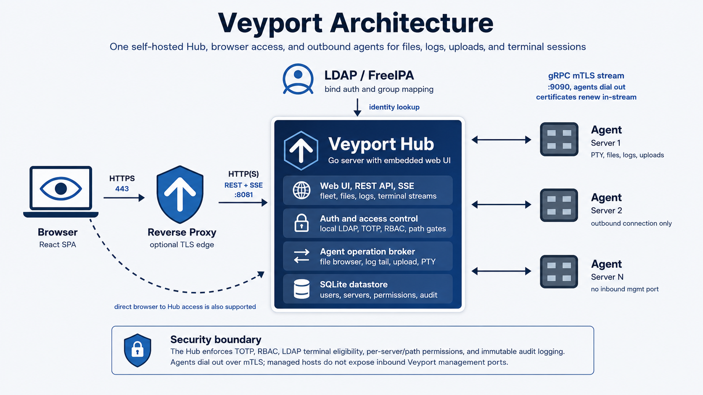
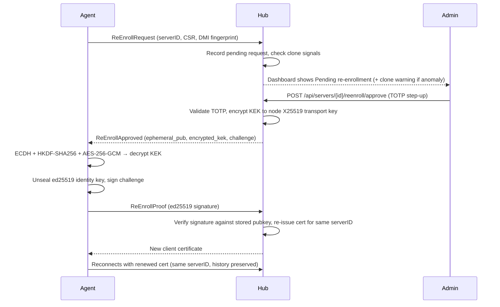

# Veyport Architecture

Veyport uses a **Hub-and-Spoke** model. The Hub is the central server that hosts the web UI, REST API, and SQLite database. Agents are lightweight binaries deployed on each remote server and maintain persistent gRPC streams back to the Hub.

## Components

- **Browser** - React single-page app served by the Hub over HTTPS.
- **Hub** - Go server that serves the web UI, exposes REST APIs, stores state in SQLite, enforces authentication and authorization, and brokers requests to agents.
- **SQLite** - Local persistent store used for users, audit logs, server inventory, and configuration.
- **Agent** - Lightweight Go binary running on each managed server. It maintains a long-lived gRPC connection to the Hub and performs file, log, upload, and PTY terminal operations on demand.

## Data Flows

- **Browser -> Hub** - HTTPS for the web UI, REST API calls, and SSE log streaming.
- **Hub -> SQLite** - Local database access with WAL mode for persistent state.
- **Agent <-> Hub** - Long-lived gRPC over mTLS for registration, heartbeats, file operations, log tailing, uploads, terminal sessions, and certificate renewal.

## Security Boundaries

- All user access goes through the Hub, which enforces session auth, TOTP, RBAC, and per-server or per-path authorization.
- Browser terminal sessions are additionally limited to admins or LDAP users with terminal group membership and a root (`/`) assignment on the target server. API tokens cannot open terminal sessions.
- Agents do not accept inbound management traffic from the Hub. They dial out to the Hub, which reduces exposed attack surface on managed hosts.
- Agent connections use Hub-issued client certificates for mTLS after bootstrap registration.

## Agent Certificate Lifecycle

Agent connections are authenticated with **Hub-issued short-lived client certificates** over mTLS. The certificate lifetime is configurable (`agent_cert_validity_hours`, default 24 h).

- **Auto-renewal (adopt-live):** While an agent is connected, it requests renewal approximately 6 hours before expiry. The Hub issues a fresh certificate over the existing stream — no reconnect required — and the agent adopts it immediately.
- **Expiry recovery (re-enrollment):** If a node is offline longer than its certificate lifetime the cert expires and the node cannot reconnect on its own. The agent phones home over the CA-pinned bootstrap channel and requests re-enrollment. The hub places the node in **Pending re-enrollment** state until an admin approves.

### Re-Enrollment Flow

### Re-Enrollment Security Model

- Each node holds a durable **ed25519 identity key** sealed at rest under a **KEK** held by the Hub, plus an **X25519 transport key** (public half registered at enrollment; private half stored unsealed at `node_transport.key`).
- On approval the Hub encrypts the KEK to the node's X25519 transport public key — sealed box: **X25519 ECDH + HKDF-SHA256 + AES-256-GCM**, context string `veyport-kek-transport-v1`. The raw KEK never crosses the network unencrypted.
- After decrypting the KEK, the agent unlocks its identity key and signs a hub-issued challenge (ed25519); the Hub verifies the signature before completing re-issuance.
- The **human TOTP step-up** is the primary control gate. A caller without a valid admin TOTP code cannot trigger a KEK release, and cannot produce a valid ed25519 proof without the node's own private key.
- **Clone detection:** the node's DMI system UUID recorded at enrollment is compared on each re-enrollment request; a mismatch surfaces as a **"possible clone"** warning at approval time (advisory, not a hard block).
- **Legacy nodes** enrolled before transport keys were introduced cannot re-enroll; the approval endpoint returns **409 "re-register required"** and the node must be re-registered once to gain transport-key support.

---

## Related Guides

- [[Deployment]] - General deployment model and runtime flags
- [[Proxy Configuration]] - Reverse proxy and gRPC passthrough details
- [[Development]] - Local development architecture and repo layout
