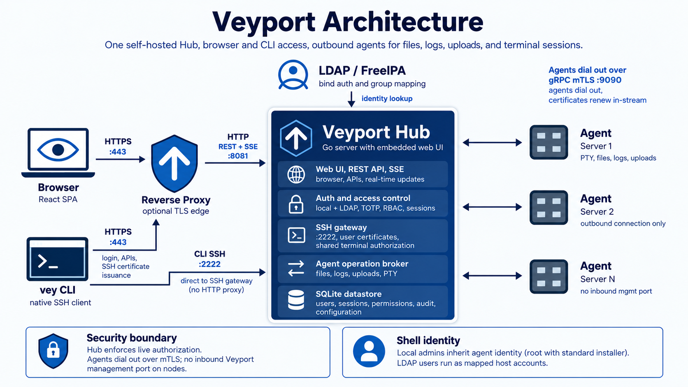
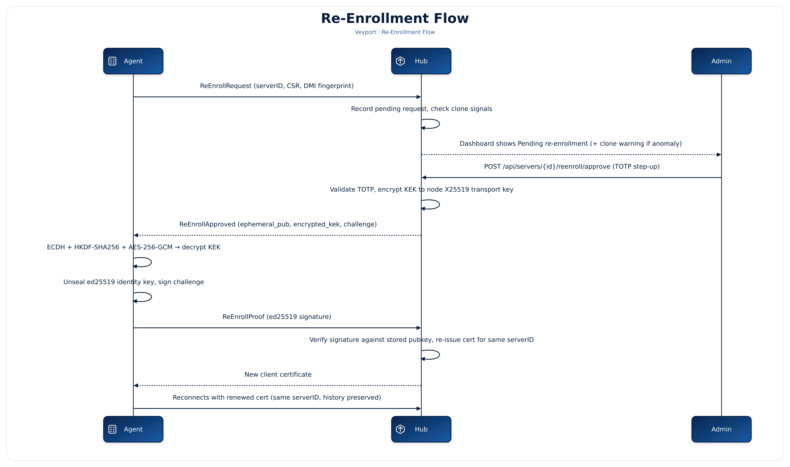

# Veyport Architecture

Veyport uses a **Hub-and-Spoke** model. The Hub hosts the web UI, REST API, SSH gateway, and SQLite database. Browsers and the `vey` CLI connect to the Hub; agents deployed on managed servers maintain persistent gRPC streams back to it.

## Components

- **Browser** - React single-page app served by the Hub over HTTPS.
- **CLI (`vey`)** - Standalone client for HTTPS API operations and native interactive SSH. The Hub serves platform-specific CLI binaries through `/install/cli/{os}/{arch}`.
- **SSH gateway** - Hub listener on `:2222` by default. Validates Hub-issued SSH certificates and brokers terminal sessions through the existing agent stream; it does not connect to the managed server's SSH daemon.
- **Hub** - Go server that serves the web UI, exposes REST APIs, stores state in SQLite, enforces authentication and authorization, and brokers requests to agents.
- **SQLite** - Local persistent store for users, sessions, audit logs, server inventory, configuration, and persisted gateway keys.
- **Agent** - Lightweight Go binary running on each managed server. It maintains a long-lived gRPC connection to the Hub and performs file, log, upload, and PTY terminal operations on demand.

## Data Flows

- **Browser -> Hub** - HTTPS for the web UI, REST API calls, and SSE log streaming.
- **CLI -> Hub HTTP** - HTTPS for login, fleet/file/log operations, and SSH certificate issuance.
- **CLI -> Hub SSH gateway -> Agent** - The CLI invokes the operator's native SSH client. The gateway checks the certificate principal and current server permissions, then relays PTY input/output over the agent's existing gRPC connection.
- **Hub -> SQLite** - Local database access with WAL mode for persistent state.
- **Agent <-> Hub** - Long-lived gRPC over mTLS for registration, heartbeats, file operations, log tailing, uploads, terminal sessions, and certificate renewal.

## Security Boundaries

- All user access goes through the Hub, which enforces session auth, TOTP, RBAC, and per-server or per-path authorization.
- Browser and SSH terminal sessions share `AuthorizeTerminalExecution`: admins are permitted; other users must be LDAP users with terminal access and a root (`/`) path assignment on the target server. API tokens cannot open browser terminal sessions or obtain SSH certificates.
- Veyport authentication identifies the operator; it does not by itself select the OS account running the shell. See the execution identity table below.
- Agents do not accept inbound management traffic from the Hub. They dial out to the Hub, which reduces exposed attack surface on managed hosts.
- Agent connections use Hub-issued client certificates for mTLS after bootstrap registration.

## Terminal Execution Identity

The SSH gateway and browser terminal use the same agent PTY manager. The Hub sends
`TerminalOpenRequest.run_as_user` after authorizing the operator:

| Veyport account | Agent execution identity |
|---|---|
| Local admin | Empty `run_as_user`: inherit the agent process identity. The standard systemd installer omits `User=`, so the agent and shell run as **root**. |
| LDAP admin | Mapped LDAP username on the managed host. |
| LDAP user with terminal access and a `/` assignment | Mapped LDAP username on the managed host. |
| Other local users or LDAP users without required permissions | Terminal access refused. |

For a mapped user, the agent resolves the host account, applies its UID, GID, and
supplementary groups, and uses its home directory when no working directory was
requested. A missing mapped account fails instead of falling back to root. `vey ssh`
has no option to choose an arbitrary OS user. A `/` assignment is an authorization
requirement, not a filesystem sandbox; shell access follows the selected account's
OS permissions. See [[SSH Gateway]] and [[Server Detail]].

## Session Activity and Lifetimes

Completed browser and CLI sign-ins create server-side sessions. Access and refresh
tokens bind to the session ID. The default idle limit is **15 minutes** and the
absolute lifetime is **12 hours**; administrators configure both in Account policy.
Validated authenticated requests update `last_seen_at`, with writes throttled to
`min(60 seconds, idle limit / 10)` (60 seconds when idle expiry is disabled).

Signed-in pages also report recent keyboard, pointer, input, touch, and scroll
interaction through `HEAD /api/auth/me`, independently of data polling. Checks are
throttled to one per 15 seconds and stop when the tab is hidden or interaction has
been absent for 30 seconds. Merely opening or returning to a visible tab does not
start these checks. Each activity request and the shared token refresh have a
10-second timeout. Network failures can be retried during recent activity; only
the Hub decides whether a session is still valid. Existing authenticated data
polling also counts as activity, so visible polling can keep an unattended tab
alive until its absolute limit. See [[Logging In]] and [[Troubleshooting]].

SSH certificates have a separate validity period and are checked when connecting.
Established shells are not governed by HTTP session idle or absolute timers, and
certificate expiry does not terminate an existing SSH connection. Administrative
session revocation and account disable can close running shells through the shared
terminal registry. See [[SSH Gateway]] and [[Settings]].

## Agent Certificate Lifecycle

Agent connections are authenticated with **Hub-issued short-lived client certificates** over mTLS. The certificate lifetime is configurable (`agent_cert_validity_hours`, default 24 h).

- **Auto-renewal (adopt-live):** While an agent is connected, it requests renewal approximately 6 hours before expiry. The Hub issues a fresh certificate over the existing stream — no reconnect required — and the agent adopts it immediately.
- **Expiry recovery (re-enrollment):** If a node is offline longer than its certificate lifetime the cert expires and the node cannot reconnect on its own. The agent phones home over the CA-pinned bootstrap channel and requests re-enrollment. The hub places the node in **Pending re-enrollment** state until an admin approves.

### Re-Enrollment Flow

### Re-Enrollment Security Model

- Each node holds a durable **ed25519 identity key** sealed at rest under a **KEK** held by the Hub, plus an **X25519 transport key** (public half registered at enrollment; private half stored unsealed at `node_transport.key`).
- On approval the Hub encrypts the KEK to the node's X25519 transport public key — sealed box: **X25519 ECDH + HKDF-SHA256 + AES-256-GCM**, context string `veyport-kek-transport-v1`. The raw KEK never crosses the network unencrypted.
- After decrypting the KEK, the agent unlocks its identity key and signs a hub-issued challenge (ed25519); the Hub verifies the signature before completing re-issuance.
- The **human TOTP step-up** is the primary control gate. A caller without a valid admin TOTP code cannot trigger a KEK release, and cannot produce a valid ed25519 proof without the node's own private key.
- **Clone detection:** the node's DMI system UUID recorded at enrollment is compared on each re-enrollment request; a mismatch surfaces as a **"possible clone"** warning at approval time (advisory, not a hard block).
- **Legacy nodes** enrolled before transport keys were introduced cannot re-enroll; the approval endpoint returns **409 "re-register required"** and the node must be re-registered once to gain transport-key support.

---

## Related Guides

- [[Deployment]] - General deployment model and runtime flags
- [[Proxy Configuration]] - Reverse proxy and gRPC passthrough details
- [[Development]] - Local development architecture and repo layout
