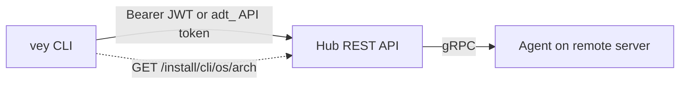

# CLI (`vey`)

> **TL;DR**
> - **What:** `vey` is a standalone command-line client for the Veyport Hub REST API — sign in, browse the fleet, read files and tail logs, export audit history, all scriptable
> - **Who:** Operators who want fleet visibility from a terminal, and automation/scripts that need non-interactive access
> - **Why:** Everything the web UI shows for servers, files, logs, and audit is also reachable as a scriptable command, with stable exit codes and `--json` output
> - **Where:** Download the binary from your own Hub at `/install/cli/{os}/{arch}`
> - **How:** Interactive sign-in (`vey login`) for humans, or an API token via `VEYPORT_TOKEN` for scripts — both talk to the Hub over the same Bearer-authenticated REST API described in [[API Reference]]

---

## Table of Contents

1. [Overview](#overview)
2. [Install](#install)
3. [Authentication](#authentication)
4. [Configuration](#configuration)
5. [Command Reference](#command-reference)
6. [Exit Codes](#exit-codes)
7. [TLS](#tls)
8. [Scripting Notes](#scripting-notes)

---

## Overview

`vey` is a Go binary that talks to the same Hub REST API the web dashboard uses (`Authorization: Bearer <token>`, JSON bodies, `Cache-Control: no-store`). There is no cookie handling and no CSRF token — Bearer requests bypass CSRF the same way a CLI-created API token does.

`vey` currently covers fleet visibility, remote file/log access, and audit export. There is no interactive terminal command yet — `vey terminal` is planned for a future release. Until then, use the web dashboard's terminal (see [[Server Detail]]).



## Install

Binaries are served directly by your own Hub — there is no separate download site. Pick your platform and verify the checksum before running anything:

```bash
# Linux, amd64
curl -fLo vey https://hub.example.com/install/cli/linux/amd64
curl -fs https://hub.example.com/install/cli/linux/amd64/sha256
sha256sum vey    # compare against the value printed above
chmod +x vey && ./vey --version
```

```bash
# Linux, arm64
curl -fLo vey https://hub.example.com/install/cli/linux/arm64
curl -fs https://hub.example.com/install/cli/linux/arm64/sha256
sha256sum vey
chmod +x vey && ./vey --version
```

```bash
# macOS, Apple Silicon (arm64)
curl -fLo vey https://hub.example.com/install/cli/darwin/arm64
curl -fs https://hub.example.com/install/cli/darwin/arm64/sha256
shasum -a 256 vey
chmod +x vey && ./vey --version
```

```bash
# macOS, Intel (amd64)
curl -fLo vey https://hub.example.com/install/cli/darwin/amd64
curl -fs https://hub.example.com/install/cli/darwin/amd64/sha256
shasum -a 256 vey
chmod +x vey && ./vey --version
```

| Platform | `os` | `arch` |
|---|---|---|
| Linux x86-64 | `linux` | `amd64` |
| Linux ARM64 | `linux` | `arm64` |
| macOS Intel | `darwin` | `amd64` |
| macOS Apple Silicon | `darwin` | `arm64` |

Move the verified binary onto your `PATH` (e.g. `sudo mv vey /usr/local/bin/vey`). There is no auto-update mechanism — re-run the install to pick up a newer build.

## Authentication

`vey` supports two authentication modes. Precedence (highest wins): **`--hub`/`VEYPORT_TOKEN` flags and env** > **config file**. Within that, an API token (from the environment or config) always wins over a stored interactive session.

### Interactive login (humans)

```bash
vey --hub https://hub.example.com login
```

This runs the same three-leg flow as the web UI: username (defaults to `$USER`, editable), password (no echo), then a TOTP code (60-second validity noted in the prompt). If your account has not yet enrolled in TOTP, `vey login` prints web-enrollment instructions and exits without storing anything — 2FA enrollment happens through the browser (see [[Logging In]]), not the CLI.

On success, `vey` persists a refresh token so you don't have to log in again for every command:

- **Preferred:** the OS keyring (`zalando/go-keyring`, service `veyport-cli`), if one is available and usable.
- **Fallback:** `~/.config/vey/credentials.json` at `0600` permissions, used automatically when no usable keyring is found (headless session, no D-Bus, locked keychain, etc.). `vey` prints a one-time warning to stderr the first time it falls back, so you know your protection level dropped.

Re-running `vey login` replaces the stored session for that hub. `vey logout` invalidates the session at the Hub (best effort) and always removes the local credentials for the effective hub, regardless of whether the server call succeeded.

Nothing ever prompts when stdin is not a TTY — a non-interactive `vey login` fails fast with API-token guidance instead of hanging.

### API tokens (scripts and automation)

For CI, cron jobs, or any non-interactive use, use an API token instead of a stored session. An admin creates one on the Hub host:

```bash
# Docker deployment
docker exec veyport /app/veyport admin create-api-token \
  --username scanner \
  --name vey-automation \
  --expires-in 720h \
  --db /data/veyport.db
```

Then set it for `vey` to pick up:

```bash
export VEYPORT_TOKEN=adt_...
vey --hub https://hub.example.com servers list --json | jq '.total'
```

`VEYPORT_TOKEN` always wins over a stored interactive session, even if one exists — this lets scripts run alongside your own logged-in shell without interference. A token can also be set per-hub in the config file (see below); the environment variable still takes precedence over that. A value that doesn't start with `adt_` is rejected locally as a usage error (exit 2) before any request is sent, so a mistyped secret never reaches the network.

Token-holding credentials satisfy every route `vey` uses — none of them are interactive-only. (Interactive-only routes, like the web terminal, reject API tokens; `vey` doesn't call any of those today.)

## Configuration

`vey` reads `~/.config/vey/config.json` (or `$XDG_CONFIG_HOME/vey/config.json` when `XDG_CONFIG_HOME` is set). It's a plain JSON file:

```json
{
  "default_hub": "https://hub.example.com",
  "hubs": {
    "https://hub.example.com": {
      "api_token": "adt_..."
    }
  }
}
```

| Field | Meaning |
|---|---|
| `default_hub` | Hub URL used when `--hub`/`VEYPORT_HUB` aren't set |
| `hubs.<url>.api_token` | Per-hub API token, used when `VEYPORT_TOKEN` isn't set |

The file is optional — a missing file just means nothing is configured yet, not an error.

### Precedence

| Setting | Order (highest wins) |
|---|---|
| Hub URL | `--hub` flag > `VEYPORT_HUB` env > `default_hub` in config |
| Auth mode | `VEYPORT_TOKEN` env > `api_token` in config (for the effective hub) > stored interactive session > none |

Hub URLs are normalized (lowercased host, scheme+host+port only) and must be `https://` except for `localhost`/`127.0.0.1`/`::1`, which may use plain `http://`. Credentials are scoped per normalized hub URL — a token or session for one hub is never used against another.

### Global flags

| Flag | Meaning |
|---|---|
| `--hub <url>` | Overrides `VEYPORT_HUB` and the config file for this invocation |
| `--json` | Machine-readable output (see [Scripting Notes](#scripting-notes)) |
| `--help` | Print usage and exit |
| `--version` / `-v` | Print the `vey` version and exit |

Global flags precede the subcommand; each subcommand's own flags follow it (e.g. `vey servers list --status online`).

## Command Reference

This section transcribes the command contract in `specs/004-cli-connector/contracts/cli-commands.md`.

### `vey login`

Interactive three-leg sign-in against the effective hub. Prompts for username (default `$USER`, editable), password (no echo), and a TOTP code (60 s validity). If TOTP enrollment hasn't happened yet, prints web-enrollment instructions and exits (code 3) without storing anything. On success, persists the refresh token (keyring, or 0600 file fallback with a one-time warning) and prints the signed-in identity and hub. Idempotent — a second `vey login` replaces the stored session for that hub.

### `vey logout`

Invalidates the session at the Hub (best effort — a dead session still clears locally) and removes stored credentials for the effective hub only. Exits 0 even if the server-side call fails (with a stderr note); exits 3 only when there was nothing to log out (no stored session, or the active credential is an API token rather than a session).

### `vey status`

Reports the effective hub (and which source set it), the auth mode (`api token (adt_xxxx…)` / `interactive session as <user> (<role>)` / `not signed in`), hub reachability (a `GET /api/auth/me` round-trip), and which credential storage backend is in use (keyring vs. fallback file). Exits 0 if authenticated and reachable, 3 if not authenticated or the reachability check fails with an auth error, 6 if the hub is unreachable. `--json` emits `{hub, hub_source, mode, username, role, reachable, storage}`.

### `vey servers list [--status <s>] [--search <q>] [--limit N] [--offset N]`

Human output: an aligned `NAME  STATUS  ID` table, with the `total` count reported to stderr. `--json`: the Hub's response envelope passed through unmodified. Exits 0 even when zero servers match the filters.

### `vey servers get <server>`

`<server>` is a server ID or a unique name. `vey` looks it up directly by ID first; if that 404s, it falls back to exactly one name-search call — ambiguous name matches exit 2 and list the candidates. Human output: a field/value listing. `--json`: the raw server object. Unknown server exits 5.

### `vey files ls <server> <path>`

Human output: an `ls -l`-style listing (type marker, size, name; entries the caller can't read are annotated `(unreadable)`). `--json`: the `files` entries array. A `403` from the Hub (path outside your permitted roots) exits 4; an offline agent exits 6.

### `vey files cat <server> <path>`

Streams the raw file bytes to stdout, suitable for piping or redirecting. No `--json` variant beyond the shared error shape — content is binary-safe passthrough either way. Same error mapping as `ls`.

### `vey logs tail <server> <path> [--grep <pattern>]`

Streams matching lines to stdout as they arrive over Server-Sent Events; filtering happens server-side via `--grep`. Ctrl-C is a clean exit 0 at any point (resolving the server, connecting, or mid-stream). An unexpected stream close (the hub or agent ended it, not you) prints a stderr notice and exits 6. `--json`: JSON-lines, one `{"line": "..."}` document per line. At most one partial line is buffered client-side while frames are reassembled.

### `vey audit export`

Streams the Hub's audit export to stdout unmodified; `--json` is a documented no-op passthrough since the response is already machine-consumable JSON. Role-gated to admin/auditor — any other role gets a `403`, which exits 4.

### Not yet supported

`vey terminal` (a future release), creating/listing/revoking API tokens from the CLI, and any admin mutation (creating/deleting users or servers) are out of scope for this version of `vey`. Use the web dashboard or `veyport admin ...` on the Hub host for those.

## Exit Codes

| Code | Meaning |
|---|---|
| `0` | Success |
| `1` | Unexpected/generic error |
| `2` | Usage error (bad flags/arguments, ambiguous server name, malformed API token) |
| `3` | Authentication failure (not signed in, expired/invalid credentials, refresh exhausted) |
| `4` | Permission denied (`403` with otherwise-valid auth) |
| `5` | Not found (unknown server or path) |
| `6` | Connectivity failure (dial/TLS/timeout, or a stream that dropped unexpectedly) |
| `7` | Rate-limited (`429`) — `vey` never auto-retries into a limiter |

Exit codes are stable and intended for scripting: distinguish "re-authenticate" (3) from "you don't have access" (4) from "try again later" (7).

## TLS

`vey` verifies every Hub connection against your operating system's trust store, with no way to turn that off. There is no `--insecure`, `--skip-verify`, or custom-CA flag anywhere in the CLI — this is deliberate, not an oversight.

If your Hub uses a certificate from a private/internal CA, install that CA into your OS's trust store before using `vey` against it; the same certificate that a browser would need to trust the web UI is what `vey` needs too. An untrusted or otherwise invalid certificate produces a distinct exit-6 error that names the specific problem (unknown authority, invalid/expired certificate, or hostname mismatch) and points at installing the CA — never a generic connection failure.

## Scripting Notes

- **`--json` everywhere.** Every command supports `--json` for machine-readable output. With `--json`, stdout is exactly one JSON document per command (or JSON-lines for streaming commands like `logs tail`) — never mixed with human-readable text.
- **stdout/stderr discipline.** stdout carries payload only. Diagnostics, warnings, and progress notices (rate-limit backoff notes, dropped-log-line warnings, the one-time keyring-fallback warning) always go to stderr, in both human and `--json` mode. This means you can safely pipe stdout (`vey files cat ... | grep ...`, `vey audit export > audit.ndjson`) without stderr noise leaking into the data.
- **JSON error shape.** In `--json` mode, a failing command writes `{"error": "...", "code": <exit-code>}` to stderr as a single JSON document and exits with the matching code — check `$?` rather than trying to parse stdout on failure.
- **No TTY, no prompts.** No `vey` command ever prompts when stdin is not a TTY. `vey login` under a non-interactive stdin fails immediately with exit 3 and points at API-token setup instead of hanging a script.
- **Secrets are never echoed.** Passwords, TOTP codes, refresh tokens, and API tokens are never written to stdout, stderr, or `--json` output. `vey status` shows only a token's `adt_xxxx…` prefix, never the full value.

---

*Related: [[API Reference]] for the underlying REST endpoints, [[Logging In]] for the web login/2FA flow, [[Fleet Dashboard]] and [[Server Detail]] for the equivalent web UI views.*
