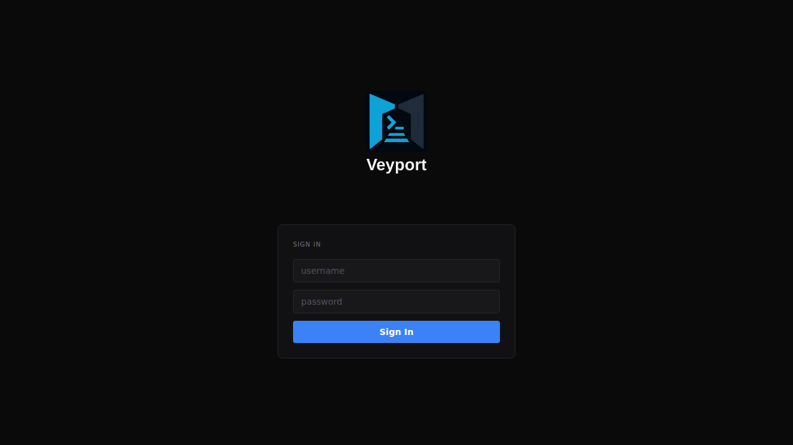
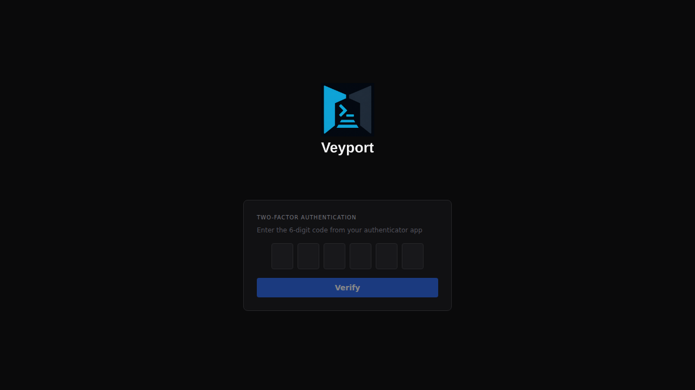

# Logging In

> **Quick Reference**
>
> Username + Password &rarr; TOTP Code &rarr; Dashboard

---

## Step 1: Enter Your Username and Password

Navigate to the Veyport URL and you will see the login page.



Enter your username and password, then click **Sign In**.

If the username or password is wrong, you will see an error message. After 5 failed attempts in one minute, login is temporarily blocked from your IP address. Wait a minute and try again.

Separately, after too many consecutive failed attempts against the same account (the default is
5), Veyport locks that account and the page shows **"account temporarily locked — try again
later"**. Wait for the lock to lift - by default 15 minutes - or ask an administrator to unlock
it, then try again. A correct password does not bypass an active lock.

Two other messages can appear here instead of the usual wrong-password error, both before your
password is even checked:

- **"account disabled — contact an administrator"** - an administrator has turned this account
  off. Only an administrator can turn it back on.
- **"account dormant — contact an administrator"** - the account has gone unused (no sign-in and
  no API-token use) for longer than the hub's dormancy policy. An administrator can restore it
  with **Enable**.

---

## Step 2: Enter Your 2FA Code

After a correct password, Veyport will ask for your two-factor authentication code.



Open your authenticator app and find the Veyport entry. Enter the current 6-digit code shown in the app.

The code changes every 30 seconds. If the code is rejected, check that the time on your phone is correct (TOTP codes are time-based) and try the next code when the timer resets.

Click **Verify** to complete login.

---

## The 2FA Flow

Veyport enforces two-factor authentication (2FA) for every account with no exceptions. The flow works as follows:

1. **Password verification** - You submit your username and password. If correct, the server issues a short-lived session token that is only valid for the TOTP step.
2. **TOTP verification** - You enter the 6-digit code from your authenticator app. The server verifies the code against your stored TOTP secret.
3. **Session issued** - Once both factors are verified, the server issues a full session cookie. You are redirected to the Fleet Dashboard.

If either step fails, no session is created. The two-step process ensures that a compromised password alone is not enough to gain access.

---

## Signing In with a Directory Account (LDAP)

If your administrator has enabled LDAP directory integration, you can sign in with your **directory username and password** (for example, your FreeIPA or Active Directory credentials) on the same login page - there is no separate "LDAP login" button.

How it works:

1. You enter your directory username and password. Veyport verifies them against the directory.
2. On your **first** sign-in, Veyport automatically creates your account. Your role (Admin, Auditor, or Viewer) and terminal eligibility come from your directory group memberships - there is nothing to request or configure yourself.
3. You complete the same mandatory 2FA enrollment as local users. Directory authentication replaces the password step, never the TOTP step.

A few things to know:

- If you belong to groups mapped to more than one role, you receive the highest-privilege role.
- If you are not in any mapped group, sign-in is rejected - ask your admin to add you to the right directory group.
- Directory password changes happen in your directory (not in Veyport); the **Change Password** option in Settings does not apply to LDAP accounts.
- If the directory is unreachable, directory sign-ins fail but local accounts (including local admins) are unaffected.

Admins configure directory integration in [[Settings]] under the **Directory** tab.

---

## Troubleshooting

### I forgot my password

Veyport does not have a "forgot password" email flow. Ask an admin to reset your account. Admins can delete your account and create a new one, or (if the admin has server access) use the CLI break-glass command to reset your credentials.

### I lost access to my authenticator app

You cannot log in without your TOTP code. Ask an admin to disable your 2FA from the Settings > Users tab. Once an admin disables your 2FA, you can log in with just your password and will be prompted to set up a new authenticator.

If you are the only admin and you have lost your authenticator, someone with shell access to the server must run the break-glass reset command:

```bash
./bin/veyport admin reset-totp --username <your-username> --db veyport.db
```

This resets your TOTP and sets a temporary password, which is printed to the terminal.

### The code is being rejected even though it looks right

- Make sure you are entering the code for the **Veyport** entry in your authenticator, not a different service.
- TOTP codes are time-sensitive. Check that your phone's clock is set to automatic/network time.
- There is a small window of tolerance (one 30-second period before and after the current code). If the code is still rejected, contact your admin.

### I am locked out and there is no other admin

Contact whoever manages the Veyport server. They will need to run the CLI break-glass command (see above) to restore access.

### I see "account temporarily locked"

See [[Troubleshooting]] for the difference between the per-IP rate limit and the per-account lock, and how long each takes to clear - or ask an administrator to unlock the account immediately.

### I see "account disabled" or "account dormant"

These are separate from a lock and do not clear on their own. See [[Troubleshooting]] for what each means and how an administrator restores access.

For more login-related solutions, see [[Troubleshooting]].
