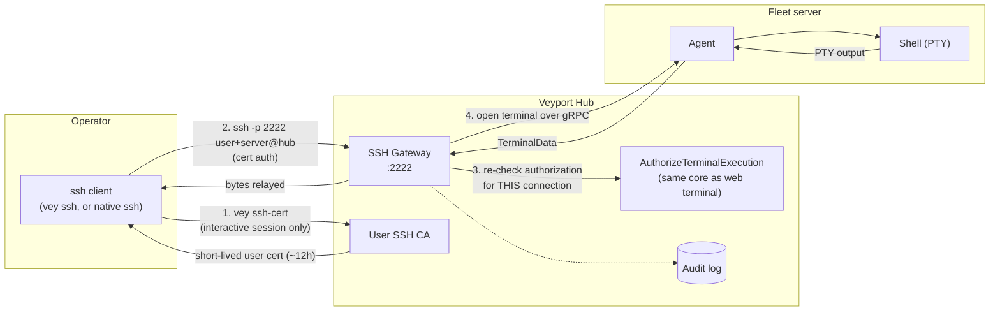

# SSH Gateway

> **TL;DR**

| Field | Value |
|---|---|
| **What** | Native `ssh` access to fleet servers, terminated at the Hub instead of connecting straight to each node |
| **Who** | Operators who already have `vey` (see [[CLI]]) and want a real terminal (full-screen editors, `htop`, window resize) instead of the browser terminal |
| **Why** | The Hub stays on the data path for every byte, so SSH sessions get the same audit trail, live authorization, and zero-agent-change guarantee as the web terminal — without requiring per-node SSH keys or `sshd` reachability |
| **Where** | A dedicated TCP port on the Hub (default `:2222`), separate from the HTTP/gRPC ports |
| **How** | `vey ssh-cert` to obtain a short-lived certificate, then `vey ssh <server>` (or a manually-constructed `ssh` command) to connect |

---

## Table of Contents

1. [Overview](#overview)
2. [Prerequisites](#prerequisites)
3. [Enrollment: `vey ssh-cert`](#enrollment-vey-ssh-cert)
4. [Connecting: `vey ssh <server>`](#connecting-vey-ssh-server)
5. [The manual `ssh` form and the `user+server` login name](#the-manual-ssh-form-and-the-userserver-login-name)
6. [Host-key pinning](#host-key-pinning)
7. [Certificate lifetime and re-issuance](#certificate-lifetime-and-re-issuance)
8. [Not supported in this release](#not-supported-in-this-release)
9. [Exit codes](#exit-codes)
10. [Troubleshooting](#troubleshooting)
11. [Hub configuration](#hub-configuration)

---

## Overview

Veyport's SSH gateway lets an operator run `ssh` directly against a fleet server, using their real terminal instead of the browser-based [[Server Detail]] terminal. The critical design choice is that the gateway is **hub-terminated**: your SSH client talks to the Hub, not to the target server. The Hub authenticates you, re-checks your authorization against live state, and then bridges your session to the target over the same hub↔agent gRPC terminal channel the web terminal already uses.

That means:

- Every SSH session is observable and audited exactly like a web terminal session — the Hub never becomes a blind relay.
- No new capability is added to the agent. The gateway is entirely a Hub-side feature; it reuses the agent's existing terminal protocol.
- Authorization (who may open a shell on which server, and as which OS user) is decided by the same rule the web terminal uses, evaluated fresh on every connection — not cached in the certificate.



## Prerequisites

- `vey` installed and a hub configured — quickest: `curl -fsSL https://<your-hub>/install/cli.sh | sh`, then `vey --hub https://<your-hub> login` (see [[CLI]] for details and manual install).
- An **interactive** `vey login` session. Certificate issuance is refused to API-token credentials — see [FR-002/SC-004 below](#enrollment-vey-ssh-cert).
- A native `ssh` client on your machine (OpenSSH or compatible). There is no bundled SSH client — `vey ssh` execs your system's `ssh`.
- The gateway must be enabled and reachable on the Hub you're connecting to (see [Hub configuration](#hub-configuration) and [Troubleshooting](#troubleshooting)).
- Linux and macOS clients. Windows clients are not supported in this release (see [Not supported](#not-supported-in-this-release)).

## Enrollment: `vey ssh-cert`

```bash
vey --hub https://hub.example.com ssh-cert
```

This provisions or refreshes your SSH credential:

1. Generates an ed25519 keypair locally if you don't already have one stored for this hub (re-running reuses the existing keypair — only the certificate is refreshed).
2. Fetches the gateway's host key (`GET /api/ssh/host-key`) and caches its fingerprint for pinning.
3. Requests a signed user certificate (`POST /api/ssh/certificates`), passing only your public key — the Hub derives the principal (your username) from your authenticated session; you cannot request a different identity.
4. Stores the private key, certificate, expiry, and host fingerprint alongside your existing `vey` credentials (same at-rest protection as your login session: OS keyring, or a `0600` file fallback).
5. Prints the resulting principal, expiry, gateway port, and host-key fingerprint.

| Property | Value |
|---|---|
| **Auth required** | Interactive `vey login` session only — an API token is refused with exit 3 before any network call |
| **Rate limit** | 10 issuance requests per minute per caller (`429` → exit 7) |
| **`--json` shape** | `{principal, expires_at, host_key_fingerprint, gateway_port}` |
| **Idempotent** | Yes — re-running refreshes the certificate and keeps the keypair |

**Why interactive-only?** SSH access is an operator capability, not something a script holding a long-lived API token should be able to reach for. The Hub enforces this server-side (`interactiveOnly` middleware); `vey ssh-cert` additionally refuses before making a request, so a misconfigured automation script fails fast and locally instead of hitting a rate limit or leaving a refusal in the audit log.

```bash
$ vey --hub https://hub.example.com ssh-cert
Signed cert for alice, valid until 2026-08-06T20:14:03Z
Gateway port: 2222
Host key fingerprint: SHA256:AbCdEf...
```

## Connecting: `vey ssh <server>`

```bash
vey --hub https://hub.example.com ssh web01
```

`vey ssh` is a thin, safe wrapper around your native `ssh` client:

1. Checks that you have a stored, unexpired certificate; if not, it explains and points you to `vey ssh-cert`.
2. Resolves `<server>` the same way `vey servers get` does — a unique name or ID; an ambiguous name lists the candidates; an unknown server is a clean not-found error.
3. Builds a temporary host-verification file from the cached gateway fingerprint (no blind trust-on-first-use prompt).
4. Execs your operator's actual `ssh` binary with the certificate, the resolved `user+server` login name, and pinned host verification — it never edits your `~/.ssh/config`.
5. Propagates the `ssh` client's exit status back to your shell.

You get a full interactive PTY: full-screen editors, pagers, `htop`, and window resizing all work, because the Hub relays raw terminal bytes and `window-change` events end-to-end over the same channel the web terminal uses.

## The manual `ssh` form and the `user+server` login name

`vey ssh` is a convenience wrapper — everything it does can also be done with a plain `ssh` command, which is useful for scripting or when `vey` isn't installed on the machine you're connecting from:

```bash
ssh -p 2222 alice+web01@hub.example.com
```

The SSH gateway addresses both **who you are** and **which server you want** in a single login name, since the SSH protocol only carries one username per connection and the gateway does not support `ProxyJump`. The login name is split on the **first** `+`:

| Part | Meaning |
|---|---|
| Left of the first `+` | Your veyport username. It must equal a principal on the certificate you present — the gateway checks `cert principal == left part`. |
| Right of the first `+` | The target server's name or ID, resolved the same way `vey servers get` resolves it. |

Because the split is on the *first* `+`, a **server name** may safely contain a `+`, but a **veyport username** may not — a username containing `+` cannot be split unambiguously and is not supported for SSH access. Affected users must use the web terminal instead. A login name with no `+` at all is rejected with an explanatory SSH banner pointing back at this format.

`vey ssh web01` is exactly equivalent to constructing this manual form using your cached certificate and host key.

## Host-key pinning

The gateway presents a stable ed25519 host key that survives Hub restarts and upgrades — it is never silently regenerated. If the stored host key ever becomes unusable (corrupted, undecryptable), the gateway disables its listener entirely rather than serve a changed identity; the rest of the Hub keeps running.

Fetch the current fingerprint at any time:

```bash
curl -H "Authorization: Bearer <token>" https://hub.example.com/api/ssh/host-key
```

or read it back from your last `vey ssh-cert` run:

```bash
vey --hub https://hub.example.com ssh-cert --json | jq -r .host_key_fingerprint
```

`vey ssh-cert` caches this fingerprint and `vey ssh` uses it to pre-configure host verification, so you are never prompted with a blind trust-on-first-use ("the authenticity of host ... can't be established") prompt the way a fresh manual `ssh` connection normally would be. If you connect manually, pass the fingerprint to your client's own pinning mechanism (for example a scoped `known_hosts` entry) instead of accepting on trust.

## Certificate lifetime and re-issuance

Certificates are short-lived — **~12 hours by default**, tunable per hub (see [Hub configuration](#hub-configuration)). A few properties worth knowing:

- The certificate binds a single principal: your username, and only your username. The Hub derives it from your authenticated session; there is no way to request a certificate for someone else.
- There is **no revocation** mechanism for issued certificates in this release. The short TTL plus fresh, per-connection authorization against live account/permission state is the accepted mitigation — see the engineering security model for the full rationale.
- A certificate expiring **mid-session does not drop that session**; only new connection attempts are re-checked against the certificate's validity, which matches standard SSH behavior.
- Re-run `vey ssh-cert` any time to refresh — it keeps your existing keypair and simply asks the Hub for a new certificate. There's no reason not to re-run it liberally; it's cheap and rate-limited generously (10/min).

## Not supported in this release

The gateway is an **interactive shell only** in v1. The following are refused cleanly at the SSH protocol level, with an explanatory message, and without disturbing any other concurrent session on the same connection:

| Capability | Behavior |
|---|---|
| Remote command execution (`ssh host cmd`) | Refused — `exec` channel requests are rejected |
| `scp` / `sftp` | Refused — the `subsystem` channel request is rejected |
| Port forwarding (`-L` / `-R` / dynamic `-D`) | Refused — forwarding channel/global requests are rejected |
| SSH agent forwarding (`-A`) | Refused — `auth-agent-req` is rejected |
| Windows clients | Not tested or supported — use the web terminal instead |

If you need any of these, use the existing [[Server Detail]] file browser/log tailer for file access, or the browser terminal for anything the interactive shell can't cover.

## Exit codes

`vey ssh-cert` and `vey ssh` use the same stable exit-code taxonomy as the rest of `vey` (see [[CLI]] for the full table):

| Code | Meaning for SSH commands |
|---|---|
| `0` | Success |
| `2` | Usage error, or an ambiguous server name for `vey ssh <server>` |
| `3` | Auth failure — API-token mode, no/expired stored certificate, or the Hub's interactive-only refusal |
| `5` | Unknown server for `vey ssh <server>` |
| `6` | Connectivity failure reaching the Hub or the gateway port |
| `7` | Rate-limited (`429`) on certificate issuance |
| *(varies)* | `vey ssh` propagates whatever exit status your native `ssh` client returns once a session is actually open |

## Troubleshooting

| Symptom | Likely cause | Fix |
|---|---|---|
| `vey ssh` says your certificate is missing or expired | No certificate issued yet, or the ~12h TTL has passed | Run `vey ssh-cert` |
| `permission denied` after a successful cert handshake | `AuthorizeTerminalExecution` denied you for this server right now — no terminal permission, no root (`/`) assignment, unknown server, or your account is disabled | Check your permissions on [[Settings]] / [[Server Detail]]; this is re-evaluated live and is intentionally not implied by having a valid certificate |
| `veyport: the SSH username must be <veyport-user>+<server>` banner | You connected without the `+server` suffix, or with a raw `ssh` command missing it | Use `vey ssh <server>`, or the manual form `ssh -p 2222 user+server@hub` |
| Connection refused / times out on port 2222 | The gateway is disabled, or the port is blocked by a firewall/proxy in front of the Hub | Confirm `ssh_gateway_enabled` and the reachability of the configured port; SSH is a raw TCP protocol and typically needs its own reverse-proxy route (a TLS-terminating HTTP proxy like Traefik does not carry it) |
| `vey ssh-cert` fails with an interactive-login error even though you're logged in | Your active credential is an API token (`VEYPORT_TOKEN` or a config `api_token`), which always wins over a stored interactive session | Unset the token for this invocation, or run `vey login` and don't set `VEYPORT_TOKEN` |
| "unknown server" / "ambiguous server name" / "server unavailable" | Target resolution failed — the name/ID doesn't exist, matches more than one server, or the target agent isn't currently connected | `vey servers list` / `vey servers get <server>` to check the name and online status |
| Host key changed warning | Should not happen — the gateway's host key is stable across restarts. If it does happen, treat it as a genuine warning and verify out-of-band before trusting the new key | Compare against `GET /api/ssh/host-key` from a trusted channel; do not just accept |

## Hub configuration

The gateway's port, whether it's enabled, and certificate TTL are administrator-tunable — there is no end-user flag for any of these:

| Setting | `_config` key | Default | Notes |
|---|---|---|---|
| Gateway enabled | `ssh_gateway_enabled` | `true` | When `false`, the port is never opened, and `POST /api/ssh/certificates` returns a clear "gateway disabled" error instead of an unusable certificate |
| Listen address | `ssh_addr` | `:2222` | Overridable per-run via the Hub's `--ssh-addr` flag; the `_config` value wins over the flag when both are set |
| Certificate TTL | `ssh_cert_ttl_hours` | `12` | Hours; applies to every certificate issued after the change, not retroactively |

An invalid or unparseable stored value falls back to the next level (DB → flag → hardcoded default) rather than failing Hub startup.

---

*Related: [[CLI]] for the full `vey` command reference and exit-code taxonomy, [[API Reference]] for the `/api/ssh/*` endpoint contracts, [[Server Detail]] for the browser-based terminal alternative, [[Audit Logs]] for reviewing `ssh.*` events.*
