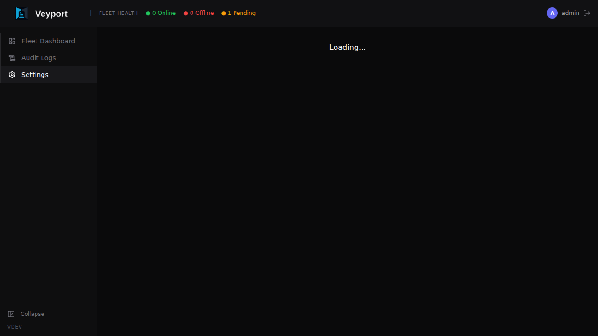
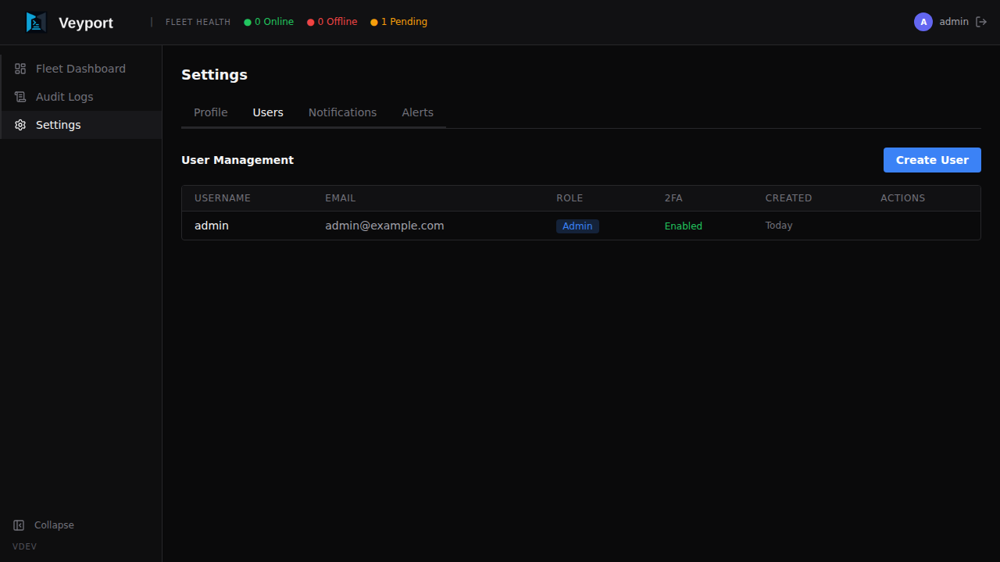

# Settings

The Settings page is accessible from the sidebar. The available tabs depend on your role:

- **Profile** - available to every user
- **Alerts** - available to every user
- **Users** - admin only
- **Directory** - admin only
- **Notifications** - admin only

Auditors do not get the admin-only Settings tabs, but they do have access to the [[Audit Logs]] page in the main sidebar.

---

## Profile Tab (All Users)

The Profile tab is available to every user: admin, auditor, and viewer.

### Changing Your Avatar

Click the avatar circle at the top of the profile section. You can upload an image from your computer. The image is stored as part of your account and shown next to your name throughout the interface.

### Changing Your Password

In the **Change Password** section:

1. Enter your **current password**
2. Enter your **new password** (must be at least 12 characters and include uppercase, lowercase, digit, and special characters)
3. Confirm the new password
4. Click **Update Password**

You will remain logged in on the current device after changing your password. All other existing sessions (on other devices) are immediately invalidated and those users will need to log in again.

---

## Users Tab (Admin Only)

The Users tab lists all accounts registered in Veyport. This tab is only visible to admins.

LDAP-backed users are created or updated when they successfully log in through LDAP. Their role and terminal eligibility come from LDAP group mapping rather than manual local-user creation.

The table includes two columns covering sign-in activity:

- **Last login** - the account's most recent successful sign-in, shown as a relative time ("just now", "5 minutes ago", "3 hours ago", "2 days ago", or a date once it's further back). Hover for the exact local date and time. Shows **Never** (muted) for an account that has not yet signed in.
- **Status** - **Active** (muted text) for an account that is not locked; a **Locked until HH:MM** warning badge for an account whose lock has not yet expired; **Locked (no auto-unlock)** for an account locked under a policy with no automatic expiry. Hover the badge for the account's current consecutive-failure count.

There is no unlock action in this release - a lock always clears on its own once it expires (see **Account Lockout Policy** below). Administrator-triggered unlock ships in a future release.

### Creating a New User

1. Click **Create User**
2. Fill in the **Username**, **Email**, and **Role** (Admin, Auditor, or Viewer)
3. Click **Create**

Veyport generates a temporary password and shows it to you once. Copy it and share it securely with the new user. They will be required to change their password and set up TOTP on their first login.

New users cannot choose their own password during account creation - they must use the temporary password you provide.

### Changing a User's Role

In the user list, click the role badge next to a user's name. A dropdown appears letting you switch between roles. The change takes effect immediately and the user's current session will reflect the new role on their next API request.

**Admin** - Full access. Can add and delete servers, manage users, configure notifications, and manage audit settings.

**Auditor** - Read-only operational access plus access to [[Audit Logs]] for exports, reviews, detections, saved filters, and flagged events.

**Viewer** - Read-only operational access. Can view the fleet dashboard and server details but cannot make changes. Specific per-server and per-path permissions can be configured separately.

> **Note:** You cannot change your own role. Another admin must do it for you.

### Disabling a User's 2FA

If a user has lost access to their authenticator app, an admin can reset their TOTP:

1. Find the user in the list
2. Click the **...** (more options) menu next to their name
3. Choose **Disable 2FA**
4. You will be asked to enter **your own** current TOTP code to confirm the action (this prevents someone with a stolen admin session from locking everyone out)
5. Click **Confirm**

The user's TOTP is cleared. The next time they log in, they will be taken through the TOTP setup flow again before getting access.

### Deleting a User

1. Find the user in the list
2. Click the **...** menu next to their name
3. Choose **Delete User**
4. Confirm the deletion

Deleting a user is permanent and cannot be undone. Their audit log entries are preserved (the entries remain, but the user_id reference becomes orphaned).

> **Note:** You cannot delete your own account. Another admin must do it for you.

### Account Lockout Policy

After too many consecutive failed sign-in attempts, Veyport temporarily locks the account so an attacker cannot keep guessing. This is separate from the per-IP rate limits described in [[Troubleshooting]] - it tracks failures against the *account*, regardless of which IP address they come from.

| Setting | Default | Meaning |
|---|---|---|
| Failure threshold | 5 | Consecutive failures that trigger a lock |
| Counting window | 15 minutes | How long a failure counts toward the threshold before the count restarts at 1 |
| Lock duration | 15 minutes | How long the account stays locked once the threshold is reached |

A few things to know:

- Both a wrong password and a wrong 2FA code count as failures against the same counter - there is no separate counter per sign-in stage.
- The policy applies uniformly to local and LDAP-backed accounts.
- Attempts against a username that doesn't exist never create a lock and are unaffected.
- A lock clears itself automatically once its expiry passes; no administrator action is required for the lock to lift.
- Existing sessions, refresh tokens, API tokens, and SSH gateway access are unaffected by a lock - lockout only blocks new sign-ins, not a session already in progress.

There is no policy UI in this release. The three values above are configured through the hub
settings API (`PUT /api/settings/hub` in [[API Reference]]) as `lockout_threshold`,
`lockout_window_minutes`, and `lockout_duration_minutes` - each an optional non-negative integer;
a field left out of the request keeps its current value.

Setting `lockout_threshold` to `0` disables locking entirely (failures are still counted and
shown in the user list). Setting `lockout_duration_minutes` to `0` means a lock never expires on
its own; until administrator unlock ships in a future release, this leaves no way to restore
access to the account, so it is **not recommended**.

A settings card for this policy, plus an administrator unlock action, ships in a future release.

---

## Directory Tab (Admin Only)

The Directory tab lets admins configure LDAP login without direct database access.

### LDAP Server

Set the LDAP URL, bind DN, bind password, user base DN, and group base DN. The bind password is write-only: Veyport shows whether a password is stored, but never returns the secret to the browser.

Use `ldaps://` for normal deployments. Plain `ldap://` is rejected unless StartTLS is enabled or insecure transport is explicitly allowed.

### Role and Terminal Groups

Map LDAP groups to Veyport access levels:

- **Admin Groups** - users become Veyport admins
- **Auditor Groups** - users can access audit workflows
- **Viewer Groups** - users receive read-only operational access
- **Terminal Groups** - users become eligible for browser terminal sessions

Terminal group membership is not enough by itself. LDAP terminal users also need a root (`/`) path assignment on the target server.

### Search and TLS

FreeIPA-compatible defaults are prefilled for user filters, group filters, and common attributes. Adjust these if your directory uses different object classes or attribute names.

Click **Test Connection** to validate the LDAP URL, TLS settings, and service bind before saving or after changing configuration.

---

## Notifications Tab (Admin Only)

The Notifications tab lets admins configure email notifications for the entire Veyport instance.

### SMTP Configuration

Configure your outbound email settings:

- **SMTP Host** - The hostname of your mail server (e.g. `smtp.gmail.com`)
- **SMTP Port** - The port to connect on (e.g. `587` for STARTTLS, `465` for SSL)
- **Username** - The SMTP authentication username
- **Password** - The SMTP authentication password
- **From Address** - The sender address that will appear on notification emails (e.g. `veyport@example.com`)

Click **Save** to store the SMTP configuration. Credentials are encrypted at rest.

### Test Email

After saving your SMTP settings, click **Send Test Email** to send a test message to your own email address. This verifies that the SMTP configuration is correct and that emails can be delivered. A success or failure message is shown immediately.

### Notification Log

Below the SMTP configuration, a log shows recent notification delivery attempts:

- **Timestamp** - When the notification was sent
- **Recipient** - Who it was sent to
- **Subject** - The email subject line
- **Status** - Whether delivery succeeded or failed
- **Error** - If the delivery failed, the error message from the SMTP server

---

## Agent Tab (Admin Only)

The Agent tab contains settings that control agent certificate behaviour.

### Agent Certificate Validity

| Setting | Default | Description |
|---------|---------|-------------|
| `agent_cert_validity_hours` | `24` | Lifetime (in hours) of issued agent client certificates. Lower values tighten rotation; the value must stay comfortably above the 6-hour renewal margin used by the agent. Applies to newly issued and renewed certificates. |

Agents request renewal approximately 6 hours before their certificate expires. If an agent is offline longer than its certificate lifetime, its cert expires and it can no longer reconnect on its own. It will appear on the dashboard as **Pending re-enrollment** and requires admin approval before it can rejoin. See [[Troubleshooting]] for the recovery steps.

---

## Alerts Tab (All Users)

The Alerts tab lets each user configure their personal notification preferences. Each user controls which events trigger email notifications to their address.

Available event types include:

- **Server Online** - A server's agent connected to the Hub
- **Server Offline** - A server's agent disconnected from the Hub
- **File Uploaded** - A file was uploaded to a server via the Dropzone
- **User Login** - A user logged in to Veyport
- **User Created** - A new user account was created

Toggle each event on or off. Changes are saved automatically.

> **Note:** Email notifications require a working SMTP configuration in the Notifications tab. If SMTP is not configured, alerts will be silently skipped.
