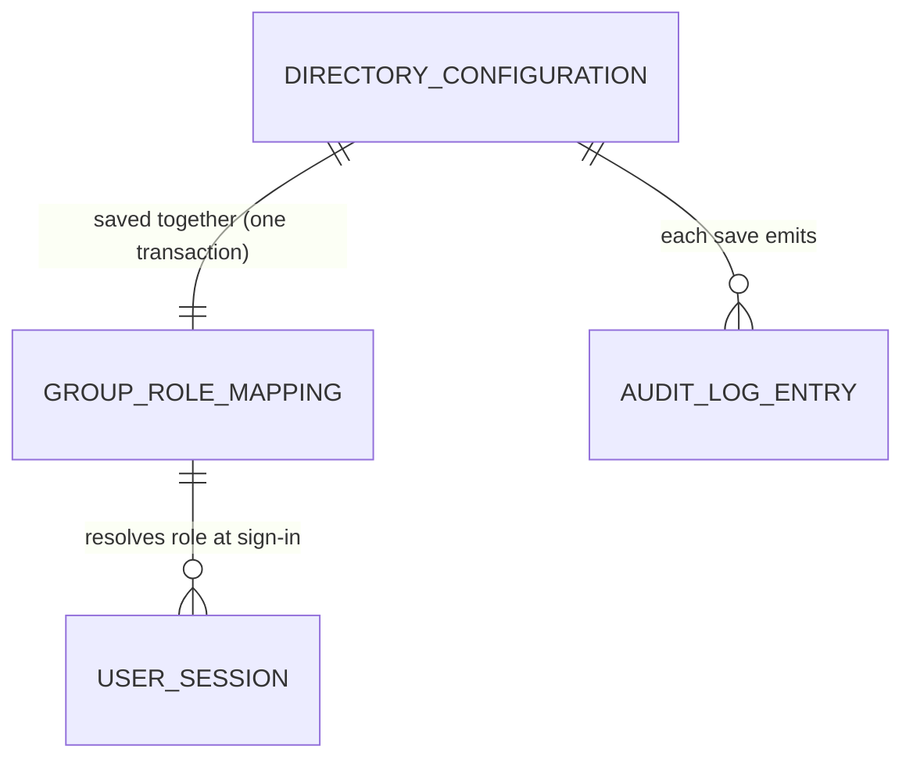

# Data Model: LDAP Directory Settings

**Phase 1 output** | Date: 2026-06-11

## Storage overview

No new tables or migrations. All state lives in the existing SQLite `_config`
key-value table as `ldap.*` keys, written atomically in one transaction per
save. Effective values = stored values overlaid on built-in defaults at load
time (`loadLDAPConfig`).

## Entity: Directory Configuration

One logical entity per installation, persisted as the following keys:

| Config key | Type (stored as text) | Default when blank | Validation (when enabled) |
|---|---|---|---|
| `ldap.enabled` | bool | `false` | — |
| `ldap.url` | string | — | **required**; `ldaps://` or `ldap://`; plain `ldap://` only with insecure opt-in or StartTLS |
| `ldap.bind_dn` | string | empty (anonymous bind) | if set, bind password required |
| `ldap.bind_password` | secret | empty | stored encrypted (`enc:` prefix); write-only |
| `ldap.user_base_dn` | string | — | **required** |
| `ldap.group_base_dn` | string | — | **required** |
| `ldap.user_search_filter` | string | `(uid={username})` | — |
| `ldap.group_search_filter` | string | `(\|(member={dn})(memberUid={username}))` | — |
| `ldap.username_attribute` | string | `uid` | — |
| `ldap.email_attribute` | string | `mail` | — |
| `ldap.external_id_attribute` | string | `entryUUID` | — |
| `ldap.group_name_attribute` | string | `cn` | — |
| `ldap.start_tls` | bool | `false` | — |
| `ldap.tls_server_name` | string | empty (derive from URL host) | — |
| `ldap.ca_cert_pem` | string (PEM) | empty (system roots) | must parse as valid PEM cert pool (`buildLDAPTLSConfig`) |
| `ldap.allow_insecure_transport` | bool | `false` | explicit opt-in for plain `ldap://` without StartTLS |

### State/lifecycle rules

- **Write-only secret**: GET responses never include `ldap.bind_password`;
  they carry `bind_password_set: bool` instead.
- **Three-way password intent** on PUT: untouched/redacted → keep; new value →
  encrypt and replace; `clear_bind_password: true` → delete.
- **Legacy plaintext**: values without `enc:` prefix are honored at load,
  logged with rotation guidance.
- **Atomicity**: all keys for a save commit in one transaction; validation
  failure leaves prior state fully intact (FR-014).
- **Enable gate**: required-field validation applies only when
  `ldap.enabled=true`; disabled drafts save freely (FR-006).

## Entity: Group-to-Role Mapping

Persisted alongside the configuration as JSON-encoded string arrays:

| Config key | Maps to | Default |
|---|---|---|
| `ldap.admin_groups` | Administrator role | `["veyport-admins"]` |
| `ldap.auditor_groups` | Auditor role | (built-in default) |
| `ldap.viewer_groups` | Viewer role | (built-in default) |
| `ldap.terminal_groups` | Terminal-access permission | (built-in default) |

**Validation**: ≤ 64 group names per field; ≤ 255 characters per name; when
enabled, at least one of admin/auditor/viewer mappings must be non-empty.
Names are normalized (trimmed, de-duplicated) on write
(`normalizeLDAPGroupList`).

**Resolution** (sign-in time, `ldap_auth.go`): the user's directory groups are
matched by name against each list; the highest-privilege matching role wins;
terminal permission is granted independently if any terminal group matches.

## Entity: Audit Log Entry

Existing `audit_logs` table; this feature adds one action:

| Field | Value |
|---|---|
| Action | `ldap.config_updated` (`model.AuditLDAPConfigUpdated`) |
| Actor | acting administrator (`AuditActorTypeUser`) |
| Outcome | `success` |
| Detail | non-secret change summary from `ldapConfigAuditDetail` (never includes the bind password) |

## Relationships

