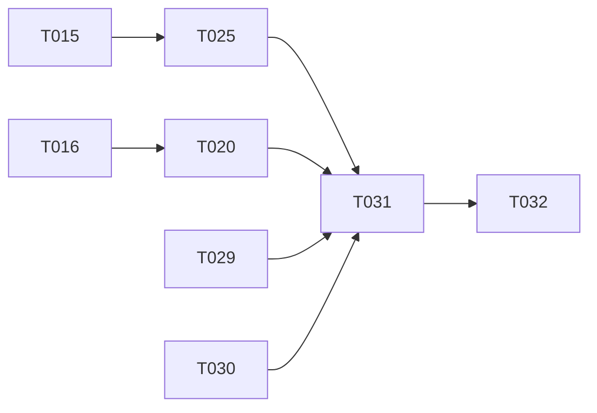

# Tasks: LDAP Directory Settings

**Input**: Design documents from `/specs/001-ldap-directory-settings/`

**Prerequisites**: plan.md, spec.md, research.md, data-model.md, contracts/ldap-config-api.md, quickstart.md

**Tests**: Included — the constitution makes testing standards NON-NEGOTIABLE (Principle II), and the plan's Constitution Check flags integration/E2E gaps (G3, G4) as merge blockers.

**Organization**: Tasks are grouped by user story. **This feature is in-flight**: work already implemented and passing in WIP commit `0259fb0` is recorded as completed (`[x]`) for traceability; only unchecked tasks remain. Remaining work maps 1:1 to the plan's Constitution Check gaps (G3, G4, G7, G8, G9).

## Format: `[ID] [P?] [Story] Description`

- **[P]**: Can run in parallel (different files, no dependencies)
- **[Story]**: Which user story this task belongs to (US1–US4)

## Phase 1: Setup (Shared Infrastructure)

**Purpose**: Project initialization — nothing required; the feature builds entirely on existing infrastructure (`_config` table, auth middleware, audit log, settings UI shell). No new dependencies, no migrations.

- [x] T001 Confirm no new dependencies or schema migrations are required (verified: `go-ldap` pre-existing, `_config` table reused)

---

## Phase 2: Foundational (Blocking Prerequisites)

**Purpose**: Core plumbing all stories depend on — **complete**.

- [x] T002 Config persistence helpers (`saveLDAPConfigValues`, transactional upsert) in hub/internal/server/handlers_ldap_config.go
- [x] T003 Effective-config loader with built-in defaults (`loadLDAPConfig`, `loadLDAPGroupMappings`) in hub/internal/server/ldap_auth.go
- [x] T004 Secret encryption at rest (`enc:` prefix, `encryptConfigSecret`/`decryptConfigSecret`) wired into config load/store paths
- [x] T005 Admin-only route registration for GET/PUT `/api/settings/ldap` and POST `/api/settings/ldap/test` in hub/internal/server/router.go
- [x] T006 `LDAPConfig` frontend type in web/src/types/api.ts
- [x] T007 Audit action `AuditLDAPConfigUpdated` in hub/internal/model/audit.go

**Checkpoint**: Foundation complete — verified by passing unit suites.

---

## Phase 3: User Story 1 - Configure directory connection from the admin UI (Priority: P1) 🎯 MVP

**Goal**: Admins view/edit the full directory configuration from Settings → Directory; saves validate, apply immediately, and never expose the bind password.

**Independent Test**: Fill in the Directory tab against a test directory, save, and have a directory user sign in — no server access or restart.

### Implementation for User Story 1 (as built)

- [x] T008 [US1] GET/PUT handlers with write-only password semantics (`bind_password_set`, keep/replace/clear) in hub/internal/server/handlers_ldap_config.go
- [x] T009 [US1] Enable-gated validation (`validateLDAPSettings`: required fields, group limits, transport, PEM) in hub/internal/server/handlers_ldap_config.go
- [x] T010 [US1] Directory tab form (load via useQuery, save via useMutation, loading/error states) in web/src/pages/settings-directory-tab.tsx
- [x] T011 [US1] Tab registration in web/src/pages/settings.tsx
- [x] T012 [US1] Handler unit tests in hub/internal/server/handlers_ldap_config_test.go
- [x] T013 [US1] Frontend unit tests in web/src/pages/__tests__/settings-directory-tab.test.tsx
- [x] T014 [US1] End-user docs in docs/wiki/Settings.md, docs/wiki/API-Reference.md, docs/wiki/Deployment.md

### Remaining for User Story 1 (gap G3, G4)

- [X] T015 [US1] Integration test: PUT `/api/settings/ldap` persists config and `ldap_auth` sign-in consumes it via injected fake directory (pattern: auth_flow_test.go) in hub/internal/integration/ldap_config_test.go
- [X] T016 [P] [US1] Playwright E2E: Directory tab renders for admin, save with missing required field shows named validation error, in tests/e2e/tests/05-settings-directory.spec.ts

**Checkpoint**: US1 fully covered at unit, integration, and UI-E2E levels.

---

## Phase 4: User Story 2 - Verify settings with "Test connection" before saving (Priority: P2)

**Goal**: Pre-save connection probe with specific failure reasons; persists nothing.

**Independent Test**: Wrong host/credentials → named failure; correct settings → success; saved config unchanged in both cases.

### Implementation for User Story 2 (as built)

- [x] T017 [US2] POST test handler with injectable dialer, 10 s timeout, stored-password reuse in hub/internal/server/handlers_ldap_config.go
- [x] T018 [US2] Test-connection UI with inline success/error feedback in web/src/pages/settings-directory-tab.tsx
- [x] T019 [US2] Unit tests for test endpoint (success/failure paths via fake dialer) in hub/internal/server/handlers_ldap_config_test.go

### Remaining for User Story 2 (gap G4)

- [X] T020 [US2] Playwright E2E: "Test connection" against an unreachable host shows failure feedback without altering saved config, in tests/e2e/tests/05-settings-directory.spec.ts (after T016 — same file)

**Checkpoint**: US2 verified end-to-end without requiring a live directory (unreachable-host path).

---

## Phase 5: User Story 3 - Map directory groups to product roles (Priority: P3)

**Goal**: Directory group names map to Admin/Auditor/Viewer roles and terminal permission; roles resolve at sign-in.

**Independent Test**: Map a group to Auditor, sign in as a member, confirm Auditor role only.

### Implementation for User Story 3 (as built)

- [x] T021 [US3] Group mapping fields, normalization, and limits (64/255, ≥1 role group) in hub/internal/server/handlers_ldap_config.go
- [x] T022 [US3] Sign-in role resolution from stored mappings in hub/internal/server/ldap_auth.go
- [x] T023 [US3] Group mapping UI (comma-separated lists, parse/join) in web/src/pages/settings-directory-tab.tsx
- [x] T024 [US3] Unit tests for mapping validation and normalization in hub/internal/server/handlers_ldap_config_test.go

### Remaining for User Story 3 (gap G3)

- [X] T025 [US3] Extend integration test: configured group→role mappings resolve to correct role and terminal permission at sign-in (highest-privilege wins), in hub/internal/integration/ldap_config_test.go (after T015 — same file)

**Checkpoint**: Role mapping proven at the integration level, not just unit level.

---

## Phase 6: User Story 4 - Secure the directory connection (Priority: P4)

**Goal**: StartTLS, TLS server name, custom CA PEM, explicit insecure-transport opt-in.

**Independent Test**: Malformed PEM rejected; plain `ldap://` refused without opt-in; private-CA TLS verifies.

### Implementation for User Story 4 (as built)

- [x] T026 [US4] Transport validation (`validateLDAPTransport`, insecure opt-in) and TLS config build (`buildLDAPTLSConfig`, PEM validation) in hub/internal/server/handlers_ldap_config.go
- [x] T027 [US4] StartTLS / TLS server name / CA PEM / insecure opt-in form controls in web/src/pages/settings-directory-tab.tsx
- [x] T028 [US4] Unit tests for transport and PEM validation paths in hub/internal/server/handlers_ldap_config_test.go

**Checkpoint**: All four user stories implemented; gaps closed by T015/T016/T020/T025.

---

## Phase 7: Polish & Cross-Cutting Concerns

**Purpose**: Constitution compliance items required before merge (gaps G7, G8, G9).

- [X] T029 [P] Update docs-internal/engineering/security-model.md: config-secret encryption scheme (`enc:` prefix, JWT-secret-derived key), write-only bind password semantics, insecure-transport opt-in, `ldap.config_updated` audit action (gap G7)
- [X] T030 [P] Split unrelated agent certificate-expiry changes (agent/internal/certs/certs.go, certs_test.go, agent/internal/client/client.go, client_test.go and hub/static/install.sh if related) out of this branch into a separate branch/PR, or document justification in the PR description (gap G8)
- [X] T031 Full verification run: `make test`, `cd web && npx vitest run`, integration suite, and confirm `sonar-project.properties` gained no new exclusions for this feature's files (constitution G1/G2)
- [X] T032 Runtime verification on the dev environment per quickstart.md §3–§5: deploy branch, exercise Directory tab (save, test connection, validation errors), confirm audit entry and `bind_password` never returned (gap G9)

---

## Dependencies & Execution Order

### Phase Dependencies

- Phases 1–6 implementation: **already complete** except the test tasks listed
- **T015 → T025**: same new file (`ldap_config_test.go`); write base test then extend
- **T016 → T020**: same new file (`05-settings-directory.spec.ts`)
- **T029, T030**: independent of everything — can start immediately [P]
- **T031**: after T015/T016/T020/T025 (it verifies them)
- **T032**: last — after T031 passes

### Remaining-work graph

### Parallel Opportunities

Three independent tracks can run concurrently:

- **Track A (integration)**: T015 → T025
- **Track B (E2E)**: T016 → T020
- **Track C (docs/hygiene)**: T029, T030 (mutually parallel)

Then T031 (verification) and T032 (dev-environment validation) serialize at the end.

---

## Implementation Strategy

The MVP (US1) and all subsequent stories are already implemented and unit-tested. Remaining work is **verification hardening + compliance**, not feature code:

1. Run tracks A, B, C in parallel (5 tasks).
2. T031 full verification run.
3. T032 dev-environment runtime verification.
4. Then the branch is constitution-compliant and ready for `superpowers:requesting-code-review` / PR.

**Suggested scope check**: if E2E (Track B) proves disproportionately expensive, the plan's Complexity Tracking already justifies deferring directory-backed E2E; T016/T020 are UI-only and need no LDAP server, so they should remain in scope.

---

## Notes

- 32 tasks total: 21 completed (as built in `0259fb0`), **8 remaining** (T015, T016, T020, T025, T029–T032), 3 foundational confirmations
- Remaining tasks map to Constitution Check gaps: G3 → T015/T025, G4 → T016/T020, G7 → T029, G8 → T030, G9 → T032
- Commit after each task or logical group
- T030 (split agent cert changes) is best done **first** if a history rewrite of the WIP commit is preferred over a follow-up extraction commit — discuss before rewriting shared history
