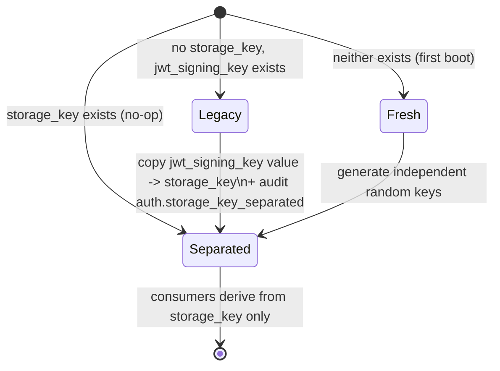

# Data Model: JWT Secret Rotation & Key Separation

**Phase 1 output** | Date: 2026-06-12

No SQL schema migration. All new state is `_config` rows plus two audit
constants.

## Config rows (`_config` key-value table)

| Key | Format | Lifecycle |
|-----|--------|-----------|
| `jwt_signing_key` | 64 hex chars (256-bit) | Existing key name; now **rotatable** via CLI. Signs all JWT types (access/refresh/setup/totp). |
| `storage_key` (new) | 64 hex chars (256-bit) | Derives (SHA-256 → AES-256-GCM) the at-rest encryption key for TOTP secrets, SMTP password, LDAP bind password, CA private key. Set once by `InitStorageKey`; **not rotatable in v1**. |
| `jwt_secret_rotated_at` (new) | RFC 3339 UTC | Set inside each rotation transaction; absent = never rotated. |

## Startup state machine (`InitStorageKey`)

Invariants: transition runs before any encryption consumer initializes
(`InitCA`, notifier); failure is fatal; re-running any path is idempotent;
the Legacy transition changes **zero ciphertexts** (derived key identical).

## Rotation transaction (single SQLite tx)

1. `jwt_signing_key` ← new random 256-bit hex
2. Revoke all active API tokens (count recorded)
3. `jwt_secret_rotated_at` ← now (UTC)
4. Commit → audit `auth.jwt_secret_rotated` (detail: revoked-token count)

Post-conditions: every outstanding JWT fails signature verification; hub
process must restart to load the new secret (documented step).

## Invalidation layering (unchanged mechanisms, documented order)

| Layer | Scope | Trigger |
|-------|-------|---------|
| Signature (rotation) | Global, all JWT types | `rotate-jwt-secret` + restart |
| JTI blacklist | Single token | Logout |
| `token_generation` claim | Single user, all tokens | Password change, role change, TOTP disable/reset |
| API-token revocation | Hashed tokens (non-JWT) | Explicit revoke; **also inside rotation tx** |

## Audit events (model/audit.go + audit_catalog.go)

| Constant | Action string | Actor | Detail |
|----------|---------------|-------|--------|
| `AuditJWTSecretRotated` | `auth.jwt_secret_rotated` | system (CLI) | revoked API-token count only |
| `AuditStorageKeySeparated` | `auth.storage_key_separated` | system (startup) | migration note, no key material |
