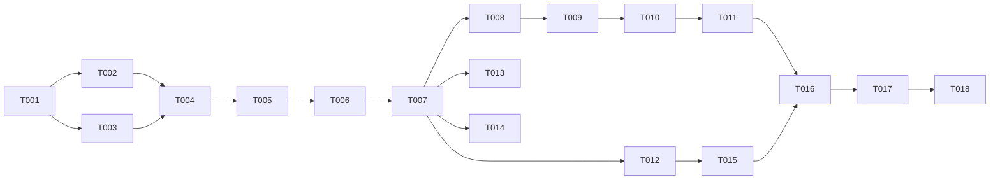

# Tasks: JWT Secret Rotation & Key Separation

**Input**: Design documents from `/specs/002-jwt-secret-rotation/`

**Prerequisites**: plan.md, spec.md, research.md, data-model.md, contracts/rotation-interfaces.md, quickstart.md

**Tests**: Included and written FIRST — FR-010 mandates unit + integration coverage and the constitution makes testing NON-NEGOTIABLE.

**Execution mode**: Per this project's speckit-implement step 6a, every implementation task below is dispatched to a `general-purpose` subagent with `model: "sonnet"`; the orchestrator reviews diffs and runs tests between dispatches. [P] tasks with disjoint files may be dispatched in one message.

**Organization**: Key separation (US2's mechanism) is **Foundational** — rotation is only safe after it, so it blocks all stories. US2's phase then verifies the lossless-migration acceptance criteria; US1 builds rotation on top; US3 adds visibility/docs.

## Format: `[ID] [P?] [Story] Description`

## Phase 1: Setup

- [ ] T001 Verify green baseline on branch 002-jwt-secret-rotation: `cd hub && go build ./... && go vet ./...` and `go test ./internal/server/ -run TestInit -count=1` pass before any changes

---

## Phase 2: Foundational (Blocking Prerequisites)

**Purpose**: Storage-key separation — the mechanism every story depends on. TDD: T003 lands failing before T004–T006 make it pass.

- [ ] T002 [P] Add audit constants `AuditJWTSecretRotated` (`auth.jwt_secret_rotated`) and `AuditStorageKeySeparated` (`auth.storage_key_separated`) in hub/internal/model/audit.go and register both in hub/internal/model/audit_catalog.go (contracts §3)
- [ ] T003 [P] Write failing unit tests for `InitStorageKey` in hub/internal/server/storage_key_test.go: fresh install → two independent random keys; legacy install (jwt_signing_key + existing `enc:` ciphertexts, no storage_key) → storage_key adopts the signing-secret value and legacy ciphertexts still decrypt; already-separated → no-op; double-run idempotent (single `auth.storage_key_separated` audit event); empty-DB edge per data-model state machine
- [ ] T004 Implement `InitStorageKey(st *store.Store) (string, error)` in hub/internal/server/server.go per research D1 (three-path init, audit on the legacy→separated transition, fatal on error) and add the storage key to server Config/struct alongside jwtSecret
- [ ] T005 Switch all four encryption consumers from the JWT secret to the storage key: hub/internal/server/handlers_auth.go (encrypt/decryptTOTPSecret), hub/internal/server/ldap_auth.go (encryptConfigSecret/decryptConfigSecret signatures + call sites incl. hub/internal/server/handlers_ldap_config.go), hub/internal/server/handlers_notifications.go (encryptSMTPPassword); update in-package tests that construct servers with secrets
- [ ] T006 Wire initialization order and external consumers in hub/cmd/veyport/main.go: `InitStorageKey` after `InitJWTSecret`, before `ca.InitCA` (pass storage key) and `notify.New` (pass storage key); update hub/internal/ca/ca.go doc comment and hub/internal/integration/testhelpers.go harness to mirror the order (contracts §4)
- [ ] T007 Gate: `cd hub && go test ./internal/server/ ./internal/ca/ ./internal/notify/ -count=1` green, `go vet ./...` clean

**Checkpoint**: Lifecycles separated — rotation can no longer strand encrypted data.

---

## Phase 3: User Story 1 — Rotate the session-signing secret safely (Priority: P1) 🎯 MVP

**Goal**: `veyport admin rotate-jwt-secret` atomically rotates, revokes API tokens, stamps rotated_at, audits — and the instance keeps working after restart.

**Independent Test**: On a populated instance, rotate; old sessions rejected, fresh password+TOTP login works, LDAP/SMTP/CA secrets all usable, no secret printed.

- [ ] T008 [US1] Write failing unit tests for the rotation command in hub/cmd/veyport/admin_rotate_test.go: secret replaced with new 256-bit hex; `jwt_secret_rotated_at` stamped RFC 3339 UTC; all active API tokens revoked with count returned; `auth.jwt_secret_rotated` audit entry with `{"revoked_api_tokens": N}` detail; refuses uninitialized DB; output contains no key material; tx rollback on injected failure leaves prior secret intact (FR-005)
- [ ] T009 [US1] Implement `rotate-jwt-secret` subcommand in hub/cmd/veyport/admin.go per contracts §1: single SQLite transaction (new secret + revoke API tokens + rotated_at), confirmation prompt with `--yes` bypass, post-commit audit entry, restart reminder in output; factor the core into a callable helper so tests and the integration suite can invoke it without the CLI prompt
- [ ] T010 [US1] Write integration test in hub/internal/integration/jwt_rotation_test.go: StartHarness + SetupAdmin + seed encrypted LDAP bind password and SMTP password + create API token → invoke rotation helper → assert pre-rotation access token now 401 (new server instance with re-read secret), fresh login+TOTP succeeds, LDAP bind password and SMTP password decrypt, CA loads, API token rejected, audit entry present (quickstart verification 1–7 mapped to assertions)

**Checkpoint**: Rotation works end to end on a real database — MVP shippable.

---

## Phase 4: User Story 2 — Independent key lifecycles, lossless upgrade (Priority: P2)

**Goal**: Existing installs migrate automatically and losslessly; rotation never touches stored secrets.

**Independent Test**: A DB laid out like a v2.0.3 install (no storage_key) starts up, decrypts everything, audits the migration once; a subsequent rotation changes zero ciphertexts.

- [ ] T011 [US2] Extend hub/internal/integration/jwt_rotation_test.go with the legacy-upgrade scenario: build a store with jwt_signing_key-derived `enc:` ciphertexts and no storage_key → run full init → all four consumers decrypt; exactly one `auth.storage_key_separated` audit event across two startups; rotation after migration leaves every ciphertext byte-identical and decryptable (FR-002/FR-003, spec US2 scenarios 1–3)

**Checkpoint**: Upgrade path proven on a populated database.

---

## Phase 5: User Story 3 — Rotation visibility and guidance (Priority: P3)

**Goal**: Admins can see last-rotation time in-product; operators have a documented procedure.

**Independent Test**: After a rotation, `GET /api/settings/hub` and the hub settings UI show the timestamp; docs match actual behavior.

- [ ] T012 [P] [US3] Expose read-only `jwt_secret_rotated_at` in `GET /api/settings/hub` (hub/internal/server/handlers_hub_config.go; PUT ignores it per contracts §2) with unit test in hub/internal/server/handlers_hub_config_test.go asserting null-when-never-rotated and value-when-stamped
- [ ] T013 [P] [US3] Add read-only "Signing secret last rotated" display to the hub settings UI in web/src/pages/settings-notifications-tab.tsx (where hub config renders), add the field to web/src/types/api.ts, and extend web/src/pages/__tests__/settings-notifications-tab.test.tsx for both never-rotated and rotated states
- [ ] T014 [P] [US3] Document the rotation procedure in docs/wiki/Deployment.md (routine + compromise-response, session impact, restart step, backup/restore note from quickstart) and add `jwt_secret_rotated_at` to the hub settings section of docs/wiki/API-Reference.md
- [ ] T015 [US3] Update the security model for the new key-management lifecycle in docs-internal/engineering/security-model.md AND the canonical copy in /home/wyiu/personal/veyport-internal/engineering/security-model.md: storage_key vs jwt_signing_key roles, rotation/invalidation layering table from data-model.md, and the research D1 honesty note (lifecycle decoupling, not at-rest strengthening) (FR-009)

**Checkpoint**: All three stories complete.

---

## Phase 6: Polish & Cross-Cutting Concerns

- [ ] T016 Full verification: `make test`, `cd web && npx vitest run && npx tsc --noEmit`, `gofmt -l hub/internal hub/cmd`, confirm sonar-project.properties untouched (constitution G1/G2)
- [ ] T017 Runtime verification on the test instance (veyport.yiucloud.com): build branch image, deploy, confirm `auth.storage_key_separated` fires once on upgrade startup, run `rotate-jwt-secret` per quickstart, walk verification checks 1–7 (old session dead, fresh login, LDAP test-connection passes, test email, agents connected, timestamp visible, audit entries)
- [ ] T018 Open PR to main; after merge: upgrade CMMC 3.13.10 to Fully Addressed in /home/wyiu/personal/veyport-internal/engineering/cmmc-l2-mapping.md citing hub/internal/integration/jwt_rotation_test.go + the rotation CLI, recalc the SC scorecard line, and append the changelog entry to /home/wyiu/personal/veyport-internal/engineering/assessment-changelog-2026-06.md (evidence-or-flag standard)

---

## Dependencies & Execution Order

- T001 → T002/T003 [P together] → T004 → T005 → T006 → T007 (gate)
- T007 → T008 → T009 → T010 (US1, sequential: tests → impl → integration)
- T010 → T011 (US2 extends the same integration file)
- T007 → T012 ∥ T013 ∥ T014 (US3 parallel, disjoint files); T015 after T012 (documents final behavior)
- T016 after all code tasks; T017 after T016; T018 last

### Parallel Opportunities

- T002 ∥ T003 (different files); T012 ∥ T013 ∥ T014 (API field / frontend / wiki docs) — each eligible for parallel Sonnet subagents in one dispatch message
- Everything else serializes on shared files or TDD ordering

---

## Implementation Strategy

**MVP = Foundational + US1 (T001–T010)**: separation plus working rotation is independently shippable; US2's phase (T011) is verification of the migration the foundation already implements; US3 is additive.

Per-dispatch loop (step 6a): subagent implements → orchestrator `git diff` review → targeted tests → rework via follow-up subagent if needed. Commit at each phase checkpoint.

---

## Notes

- 18 tasks: 1 setup, 6 foundational, 3 US1, 1 US2, 4 US3, 3 polish
- TDD pairs: T003→(T004–T006), T008→T009; integration tests T010/T011 double as SC-005 evidence for the CMMC upgrade in T018
- The rotation helper MUST be callable without the interactive prompt (T009) or T010/T011 can't drive it
- Never print, log, or assert on actual key material in any test output
